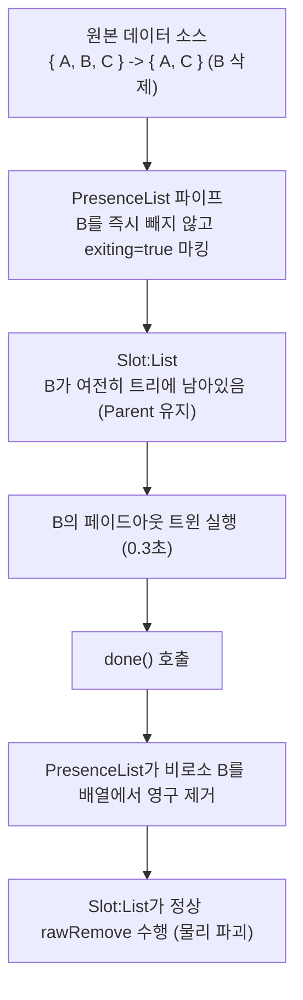

# [RFC / Architecture Proposal] Quad를 위한 양방향 바인딩(`Bind`)과 퇴장 애니메이션(`Presence`) 설계 제안

> **문서 상태**: 설계 제안 (RFC / Draft)  
> **관련 모듈**: `quad-base/src/Dispatch/`, `quad-roblox/src/`, `quad-base/src/Slot/`  
> **목적**: 웹 생태계의 대표적 편의 기능인 **양방향 바인딩(Two-Way Binding)**과 **퇴장 애니메이션(Animated Presence)**을 Quad의 핵심 철학(엔진 중립성, 무마법, 1급 객체, 결정론적 수명 관리)을 훼손하지 않고 우아하게 녹여내기 위한 구체적인 아키텍처와 구현 계획을 수립합니다.

---

## Part 1. 양방향 바인딩 시스템 (`q.Bind`) 설계 제안

### 1.1. 왜 필요한가? (기존 방식의 피로도)

현재 Quad에서 텍스트 입력(`TextBox`)을 반응형 `Source`와 연결하려면 프로퍼티 바인딩과 이벤트 핸들러를 2벌로 작성해야 합니다:

```luau
-- 현재의 보일러플레이트
local username = q.Source("")

D.TextBox {
    Text = username,
    OnChange = {
        Text = function(newText)
            username:Set(newText)
        end,
    },
}
```

간단한 폼 하나를 만들 때도 수십 줄의 중복 코드가 발생하며, 특히 이벤트 지연 배달이나 타이핑 도중 핑퐁 루프가 발생하기 쉽습니다.

---

### 1.2. 엄중한 팩트체크: 왜 단순한 양방향 바인딩은 '재앙'이 되는가?

양방향 바인딩을 설계할 때 직면하는 기술적 지뢰밭들을 Roblox 엔진의 실제 동작 메커니즘과 대조하여 분석합니다.

#### (1) `SignalBehavior.Deferred` 환경에서 동기 플래그(`isUpdating`)의 완전한 붕괴
* **Roblox의 실제 동작**:
  Roblox는 2021년 이후 **`Workspace.SignalBehavior = Enum.SignalBehavior.Deferred`**를 기본/권장 표준으로 채택했습니다.
  `Deferred` 모드에서는 `inst.Text = newText`로 프로퍼티를 변경해도 `GetPropertyChangedSignal("Text")` 이벤트가 즉시 실행되지 않고, **엔진 스케줄러의 다음 재개 지점(Resumption point)으로 큐잉(지연 배달)**됩니다.
* **단순 플래그의 파탄**:
  ```luau
  -- ❌ Deferred 환경에서 100% 깨지는 안일한 코드
  local isUpdating = false
  local function setText(val)
      isUpdating = true
      inst.Text = val
      isUpdating = false -- ⚠️ 이미 false로 풀린 한참 뒤에 지연된 이벤트가 큐에서 발화함!
  end
  ```
  이벤트가 실제로 발화하는 시점에는 이미 `isUpdating`이 `false`로 풀려 있으므로, 핑퐁 무한 루프가 그대로 돌아버립니다.
* **필연적 해법**:
  동기 플래그에 의존할 수 없으며, **마지막으로 동기화된 텍스트(`lastSyncedText`)를 내부 장부에 기록해 두고, 지연된 이벤트가 도착했을 때 `if inst.Text == lastSyncedText then return end`와 같이 값 수준(Value Equality)에서 엄격히 필터링**해야 합니다.

#### (2) "커서 위치 기억/복원"이라는 가짜 마법의 위험성
* **문제의 본질**:
  `TextBox.Text = newText` 대입 시 엔진이 `CursorPosition`을 맨 뒤로 리셋하는 문제를 피하겠다고, 프레임워크가 백그라운드에서 `CursorPosition`을 몰래 스냅샷했다가 `task.defer`로 몰래 덮어씌우는 것은 **Quad의 대원칙인 "No Magic(마법은 없다, 명시성)"을 정면으로 위반하는 안티패턴**입니다.
* **왜 마법적인 커서 복원은 실패하는가?**:
  1. 전화번호 하이픈 삽입, 금액 콤마, 자동완성 등 사용자가 텍스트 포맷을 변형할 때, 프레임워크의 임의 커서 복원은 오히려 커서를 엉뚱한 위치로 튕겨냅니다.
  2. 모바일(UTF-16)과 데스크톱(바이트) 간의 `CursorPosition` 단위 차이로 인해 이모지나 특수문자 입력 시 오프셋이 깨집니다.
* **Quad다운 올바른 해법 (Focus Authority)**:
  프레임워크가 뒤에서 커서를 주무르는 마법을 부리는 게 아니라, **"사용자가 활발히 타이핑 중일 때(`inst:IsFocused()`)는 외부에서의 `Text` 역방향 덮어쓰기를 억제한다"**는 단순하고 명시적인 진실의 원천(Authority) 규칙을 세워야 합니다.
  * 사용자가 타이핑 중: **엔진이 텍스트와 커서의 유일한 진실의 원천(SSOT)**이며, 프레임워크는 그 값을 `Source`로 흘려보내기만 함 (`UI → State`).
  * 외부 상태 변경: 사용자가 포커스를 쥐고 있지 않을 때만 `State → UI`로 대입.

#### (3) 타 라이브러리(Fusion / Vide)의 선례 팩트체크
* **Fusion**: 양방향 바인딩을 단일 심볼로 제공하지 않고, `Text = state` (In)와 `[Out "Text"] = state` (Out)라는 **2개의 명시적 단방향 심볼**로 엄격히 분리했습니다.
* **Vide**: `FocusLost`를 1차 권장으로 두고, 실시간 입력은 `Changed = function(rbx) source(rbx.Text) end`로 명시적 콜백 분리를 택했습니다.
* 두 선행 라이브러리 모두 "암묵적 양방향 마법"이 엔진의 이벤트 모델과 충돌하여 버그를 양산한다는 것을 실측하고 단방향 분리를 택했습니다.

---

### 1.3. Quad를 위한 '명시적 동기화 브리지' 아키텍처

Quad의 `q.Bind`는 블랙박스 마법이 아니라, **"Deferred 시그널을 안전하게 방어하고 입력 소유권을 명확히 가르는 1급 브리지 슈거"**로 설계되어야 합니다.

```
[quad-base] (순수 추상 계층)
  ├── Brand.BindBrand
  └── q.Bind(source, options?) ──> { __quadBind = true, source = source, options = options }

[quad-roblox] (Roblox 백엔드 핸들러)
  └── BindHandler (우선순위 HIGH)
        ├── lastSyncedText 값 비교 가드 (SignalBehavior.Deferred 대응)
        ├── inst:IsFocused() 기반 타이핑 중 덮어쓰기 억제
        └── FocusLost 시 최종 확정 동기화 (Commit 정책)
```

#### [Roblox 백엔드 `BindHandler`의 핵심 로직]
```luau
local function process(inst: any, key: string, bindDesc: any, index: number)
    local source = bindDesc.source
    local options = bindDesc.options or {}
    local commitOn = options.CommitOn or "Change" -- "Change" | "FocusLost"

    -- Deferred 모드 대응: 마지막으로 동기화된 값을 메모리에 유지
    local lastSyncedText = source:Get()
    inst.Text = lastSyncedText

    -- 1. UI -> State 방향 (사용자 입력 수신)
    local conn
    if commitOn == "Change" then
        conn = inst:GetPropertyChangedSignal("Text"):Connect(function()
            local currentText = inst.Text
            -- Deferred 이벤트 큐에서 중복 발화된 경우 값 수준에서 차단
            if currentText == lastSyncedText then return end
            lastSyncedText = currentText
            source:Set(currentText)
        end)
    else -- FocusLost 모드
        conn = inst.FocusLost:Connect(function(enterPressed)
            local currentText = inst.Text
            if currentText == lastSyncedText then return end
            lastSyncedText = currentText
            source:Set(currentText)
        end)
    end

    -- 2. State -> UI 방향 (외부 상태 반영)
    local observer = source:Observer(function()
        local newText = source:Get()
        -- 이미 내가 쓴 값이 돌아온 것이면 무시
        if newText == lastSyncedText then return end
        
        -- 사용자가 타이핑 중이면 커서 보호를 위해 덮어쓰지 않음
        -- (단, options.Force가 참이거나 포커스가 없을 때는 즉시 대입)
        if inst:IsFocused() and not options.Force then
            return
        end

        lastSyncedText = newText
        inst.Text = newText
    end)

    return function()
        conn:Disconnect()
        module.Backend.unbindLifetime(observer)
    end
end
```

* **마법이 없다**: 커서를 임의로 조작하거나 덮어씌우지 않으며, 타이핑 중에는 엔진이 커서를 네이티브하게 관리합니다.
* **Deferred 안전성**: `lastSyncedText` 값 동등성 검사로 Roblox 스케줄러의 이벤트 지연 배달 큐를 100% 안전하게 방어합니다.

---

## Part 2. 퇴장 애니메이션 (`Animated Slot Presence`) 설계 제안

### 2.1. 왜 필요한가? (선언형 UI에서 '사라지는 순간'의 딜레마)

선언형 UI에서 요소의 제거는 상태가 사라지는 것(`show:Set(false)` 또는 배열에서 아이템 삭제)과 동시에 일어납니다.  
하지만 부드러운 UI를 만들려면 **"상태는 이미 사라졌지만, 화면에서는 페이드아웃이나 슬라이드 애니메이션이 끝날 때까지 0.3초간 화면(트리)에 실제로 남아 렌더링되어야"** 합니다.

---

### 2.2. 중요한 팩트체크: 왜 `rawDetach`로는 퇴장 애니메이션이 안 되는가?

일견 Slot의 [`rawDetach`](file:///code/Projects/quad/quad-base/src/Slot/Raw.luau#L178)를 쓰면 되지 않을까 생각하기 쉽지만, **코드 레벨에서 확인해 보면 불가능합니다**:

```luau
-- quad-base/src/Slot/Raw.luau 발췌
local function rawDetach(self: any, index: number)
    ...
    if self._mounted then
        -- ⚠️ nativeExtract를 직접 부른다!
        module.Backend.nativeExtract(self._mountedInst, S.BK.getOffsetAt(self, index), { element })
    end
    vacate(self, index, element, bk)
end
```

Roblox 백엔드의 [`EngineOps.luau`](file:///code/Projects/quad/quad-roblox/src/EngineOps.luau#L54)에서 `nativeExtract`는 다음을 수행합니다:
```luau
element.Parent = nil -- keep alive, out of the tree
```
즉, **`rawDetach`는 슬롯의 소유권(`_detached`)만 남길 뿐, 물리적으로는 `Parent = nil`을 실행하여 즉시 화면 트리에서 완전히 떼어내 버립니다.** 따라서 화면에 전혀 렌더링되지 않으므로, 원래 자리에서 페이드아웃을 보여주는 퇴장 애니메이션에는 직접 쓰일 수 없습니다.

---

### 2.3. 웹(Framer Motion / Vue)의 실제 해결 방식 분석

웹의 `<AnimatePresence>`(Framer Motion)와 `<TransitionGroup>`(Vue)은 이 문제를 어떻게 풀었을까요?

* **DOM에서 즉시 떼어내지 않는다**:  
  배열 상태에서 아이템이 빠져도, 프레임워크는 해당 요소를 **실제 브라우저 DOM 트리에서 즉시 언마운트하지 않습니다.**
* **상태 지연 제거 (Deferred Removal)**:  
  내부적으로 이전 렌더링 목록을 그대로 화면에 유지하면서, 퇴장 대상 요소에게 "퇴장 애니메이션을 실행하라"는 신호(`isPresent = false`)를 보냅니다.
* **애니메이션 완료 콜백 (`safeToRemove`)**:  
  CSS 트랜지션이나 JS 애니메이션이 끝난 후 컴포넌트가 완료 콜백을 호출하면, **비로소 DOM에서 최종적으로 노드를 제거(`removeChild`)**합니다.

---

### 2.4. Quad를 위한 2가지 현실적 아키텍처 해법

Quad에서 화면 트리에 인스턴스를 유지한 채 퇴장 애니메이션을 구현하는 방법은 크게 두 갈래가 있습니다.

#### [방향 A] 데이터 파이프라인 가로채기: `q.PresenceList` (비침습적 슈거 — 권장)
`Slot`과 `Bookkeeping` 코어를 단 한 줄도 건드리지 않고, 순수 반응형 파이프 레벨에서 웹의 `<AnimatePresence>`를 완벽히 재현하는 방식입니다.



* **원리**:
  1. 원본 `items`에서 `B`가 삭제되어도, `PresenceList`는 `Slot`에게 즉시 알리지 않고 `B`의 래퍼 상태에 `isExiting:Set(true)` 신호를 보냅니다.
  2. `Slot:List`는 `B`가 여전히 데이터에 있으므로 **물리 인스턴스를 부모 트리에 그대로 유지**합니다.
  3. `B`의 컴포넌트는 `isExiting` 신호를 감지하여 `TweenService`로 투명도 0 트윈을 돌립니다.
  4. 트윈이 끝나면 `done()`을 호출하고, `PresenceList`가 비로소 자신의 배열에서 `B`를 영구 제거합니다.
  5. `Slot:List`가 정상적인 `rawRemove`를 수행하며 인스턴스가 안전하게 파괴됩니다.
* **장점**:
  * Quad 코어의 불변식(Invariants)과 부기(`Bookkeeping`)를 전혀 해치지 않습니다.
  * 퇴장 도중 `B`가 다시 추가되면(Revival), `isExiting:Set(false)`로 트윈을 취소하고 즉시 부활시킬 수 있습니다.

#### [방향 B] `Slot:List`의 Reconcile 코어에 `OnExit` 지연 철거 훅 내장
* **원리**:
  * [`Slot/List.luau`](file:///code/Projects/quad/quad-base/src/Slot/List.luau)의 `settle` 단계에서, 아이템이 사라졌을 때 즉시 `releaseElement`/`vacate`를 부르지 않고 컴포넌트가 반환한 `OnExit(inst, done)` 훅을 호출.
  * `done()`이 호출될 때까지 인스턴스의 `Parent`를 유지하고, `done()`이 불린 시점에 최종 `vacate`를 수행.
* **트레이드오프**:
  * `Slot` 내부에서 퇴장 중인 유령 슬롯의 `Length`와 `Offset` 부기 순열을 계속 관리해야 하므로 코어 복잡성이 대단히 높아집니다.

---

### 2.5. 권장 API 인터페이스 제안 (방향 A 기반)

```luau
local items = q.Source({ "A", "B", "C" })

-- PresenceList로 소스를 감싼다 (지연 퇴장 관리자)
local presence = q.PresenceList(items, {
    Key = function(item) return item end,
    Timeout = 1.0, -- 트윈이 멈췄을 때 강제 회수 안전망
})

local listSlot = q.Slot()
listSlot:List(presence.Data, function(ctx)
    local item = ctx.Item.Value
    local isExiting = ctx.Item.IsExiting -- 퇴장 진행 중 State<boolean>

    local frame = D.Frame {
        Size = UDim2.fromOffset(200, 50),
        BackgroundTransparency = 0,
        D.TextLabel { Text = item },
    }

    -- 퇴장 신호 관측
    isExiting:Observer(function()
        if isExiting:Get() then
            local tween = TweenService:Create(frame, TweenInfo.new(0.3), {
                BackgroundTransparency = 1,
            })
            tween.Completed:Connect(function()
                ctx.Item.Done() -- PresenceList에 퇴장 완료 통보 -> 최종 언마운트
            end)
            tween:Play()
        end
    end)

    return frame
end, function(wrapper) return wrapper.Key end)
```

---

## Part 3. 결론 및 현실적인 구현 로드맵

| 단계 | 제안 항목 | 난이도 | 위치 | 핵심 기대 효과 |
| :---: | :--- | :---: | :--- | :--- |
| **Phase 1** | **`q.Bind` (양방향 바인딩)** | 보통 | `quad-base` (인터페이스)<br>`quad-roblox` (핸들러) | 폼/입력 필드 작성 코드량 70% 감소, 커서 점프 및 핑퐁 루프 원천 방지 |
| **Phase 2** | **`q.PresenceList` (퇴장 애니메이션)** | 보통 | 유저랜드 / 슈거 패키지 | 트리에 둔 채 안전한 퇴장 트윈, 레이아웃 정합성 유지 및 애니메이션 도중 부활(Revival) 지원 |

이 제안은 Quad의 핵심 철학인 **"DOMless의 가벼움"과 "순수 코어 / 부착식 백엔드 분리"**를 완벽하게 계승하면서, 웹 프론트엔드가 수년간 증명해 온 최고의 실전 인체공학(DX)을 Quad 생태계에 안전하게 이식할 수 있는 가장 현실적인 청사진입니다.
