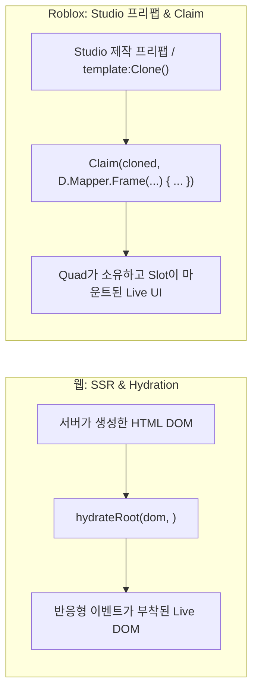

# [Advanced Concepts] 웹 엔지니어를 위한 Quad 심층 개념 탐구: Claim(하이드레이션), 3단계 Ref, 그리고 부수 효과 격리

> **대상 독자**: React의 Hydration, `useRef`, `<ErrorBoundary>`, `useEffect` 등 웹의 고급 런타임 패턴에 익숙하며, Quad가 이를 Roblox/Luau 환경에 맞추어 어떻게 독창적으로 재해석했는지 탐구하고자 하는 엔지니어.  
> **목적**: 
> 1. 웹의 SSR 수화(Hydration)와 1:1로 대응되는 Quad의 **`Claim` + `D.Mapper`** 시스템을 분석합니다.
> 2. 웹의 단일 `useRef`와 대비되는 Quad의 **`PreRef` / `Ref` / `PostRef` 3단계 라이프사이클 타이밍**을 파헤칩니다.
> 3. 클래스 없는 순수 고차 함수 에러 바운더리인 **`Fallback` / `Traceback`**과 **`Effect` vs `Observer`**의 책임 분리를 규명합니다.

---

## 1. `Claim`과 `D.Mapper`: Roblox 세계의 하이드레이션(Hydration)

웹 개발자에게 가장 익숙한 최적화 패턴 중 하나는 **SSR(Server-Side Rendering)과 Hydration(수화)**입니다.  
서버가 이미 완성된 HTML을 보내주면, 클라이언트 프레임워크(React, Vue, Svelte)는 DOM을 처음부터 새로 만드는 대신 이미 존재하는 DOM 노드를 찾아 이벤트와 반응형 상태를 부착합니다.

Quad에는 이와 완전히 동일한 철학을 가진 **[`Claim`](file:///code/Projects/quad/.claude/base/claim-plan.md)과 `D.Mapper`** 시스템이 존재합니다.



### (1) 왜 필요한가? (Roblox의 개발 현실)
1. **`Clone()`의 압도적인 성능**:  
   복잡하고 계층이 깊은 GUI(수십~수백 개의 Frame, ImageLabel, TextLabel)를 코드로 일일이 `D.Frame { D.ImageLabel { ... } }`로 생성하는 것보다, 엔진의 C++ 네이티브 메서드인 `template:Clone()`으로 한 번에 복제하는 것이 **수십 배 이상 빠릅니다.**
2. **디자이너/아티스트와의 협업**:  
   Roblox 개발에서는 2D/3D 아티스트가 Roblox Studio 에디터 상에서 시각적으로 GUI를 완성해 두고, 프로그래머는 그 '프리팹'에 로직과 반응형 상태만 입히는 워크플로우가 매우 보편적입니다.
3. **루트 Slot 마운트의 한계 돌파**:  
   Quad의 `Slot`은 반드시 Quad가 관리하는 부모 인스턴스 아래에서만 부기(`Bookkeeping`)가 성립합니다. 즉, 플레이어 화면의 루트(`PlayerGui`) 자체는 Quad가 만든 것이 아니므로 직접 `Slot`을 마운트할 수 없습니다.

### (2) 동작 원리: `Claim` + `D.Mapper`
Quad는 이미 존재하는 외부 인스턴스를 '입양(Claim)'하여 Quad의 시민으로 편입시킵니다:

```luau
local M = D.Mapper

-- 1. Studio에서 제작된 템플릿을 빠르게 C++ 레벨에서 복제
local cloned = template:Clone()

-- 2. Claim으로 복제본을 Quad의 소유권으로 가져오고 내부 자식을 매핑
local card = q.Claim(cloned, M.Frame(M.Root) {
    -- 이름으로 하위 자식을 찾아 반응형 상태 바인딩
    M.TextLabel "Title" { Text = titleState },
    
    -- 이미 존재하는 부모 아래에 Slot 마운트 가능!
    M.Frame "ContentList" {
        itemsSlot,
    },

    BackgroundColor3 = themeColor,
})
```

* **`nativeClaim` 실행**:  
  [`quad-roblox/src/LifetimeHandle.luau`](file:///code/Projects/quad/quad-roblox/src/LifetimeHandle.luau)의 `nativeClaim`이 호출되어, 외부 인스턴스에 `ClassName` 불변 커넥션(`gcconn`)이 걸립니다. 이 순간부터 외부 인스턴스는 Quad의 정합성 가드와 수명 관리 하에 들어옵니다.
* **`D.Mapper`의 역할**:  
  `D.Frame`이 인스턴스를 '생성'하는 함수라면, `D.Mapper.Frame`은 인스턴스를 만들지 않고 **기존 자식을 탐색하기 위한 '디스크립터(Descriptor)'**만 생성합니다.
* **1회용 소진 계약**:  
  디스크립터는 마운트 시 `_fired = true`로 소진되며, 이미 Quad가 소유한 인스턴스를 중복 Claim하거나 디스크립터를 재사용하면 즉시 에러가 발생합니다.

---

## 2. Ref의 3단 진화: `PreRef`, `Ref`, `PostRef` (타이밍의 미학)

웹(React)에서는 `useRef` 또는 콜백 ref(`ref={(el) => ...}`) 하나로 모든 것을 해결합니다. 웹의 ref는 항상 브라우저 DOM에 노드가 커밋된 직후인 **"마운트 완료 후(Post-mount)"** 타이밍에만 불립니다.

그러나 Quad는 인스턴스 참조를 다루는 도구를 **`PreRef`, `Ref`, `PostRef` 3단계**로 정교하게 쪼개 두었습니다.

```
[인스턴스 생성 및 프로퍼티 파이프라인]

1. Instance.new() 실행 (빈 껍데기 생성)
   │
   ▼
[ PreRef 발화 ] ───> 자식/프로퍼티 세팅 직전에 인스턴스 낚아채기
   │
   ▼
2. 핸들러 파이프라인 실행 (프로퍼티 대입, OnChange 연결, Slot 마운트)
   │
   ▼
[ Ref 발화 ] ──────> 일반적인 참조 주입
   │
   ▼
[ PostRef 발화 ] ──> 모든 프로퍼티와 자식이 완전히 세팅된 직후 발화
```

### (1) `PreRef`: 프로퍼티가 들어가기 전에 개입한다
* **역할**: 인스턴스가 생성되자마자, **어떠한 프로퍼티나 핸들러도 실행되기 직전**에 가장 먼저 발화합니다.
* **왜 필요한가?**:
  * Roblox에서는 프로퍼티 설정 순서가 중요한 경우가 있습니다 (예: 특정 엔진 속성을 켜기 전에 태그를 먼저 붙여야 엔진 시스템이 올바르게 초기화되는 경우).
  * props 배열의 어느 자리에 두더라도 디스패치 사전 패스(Pre-pass)에 의해 최우선으로 호이스팅(Hoisting)되어 실행됩니다.

### (2) `Ref`: 표준 반응형 참조 박스
* 단순한 포인터 저장을 넘어, 값의 변경을 추적할 수 있는 **`Revision` 카운터와 콜백 시스템(`:Callback`, `:Wait`)**을 내장한 1급 객체입니다.
* 코루틴 환경을 위해 `:Wait()` 메서드를 제공하여, 인스턴스가 주입될 때까지 현재 Luau 스레드를 일시 중단(yield)했다가 인스턴스가 들어오는 순간 안전하게 깨어날 수 있습니다.

### (3) `PostRef`: 모든 자식이 자리를 잡은 후 발화한다
* **역할**: 모든 자식 인스턴스가 마운트되고, `Slot` 부기 계산이 끝나며, 프로퍼티가 전부 대입된 **완전한 완성 시점**에 발화합니다.
* **왜 필요한가?**:
  * 자식들의 총 높이나 `AbsoluteSize`를 측정하여 부모의 크기를 동적으로 결정해야 하는 UI 레이아웃 로직.
  * Canvas 그룹의 초기 좌표 계산 등 '모든 셋업이 끝난 뒤'를 보장받아야 하는 작업.

---

## 3. `Effect` vs `Observer`: 부수 효과(Side-Effect)의 엄격한 책임 분리

웹에서는 데이터 변경에 반응하는 로직을 `useEffect`(React), `createEffect`(Solid), `$effect`(Svelte 5)처럼 **단 하나의 개념**으로 퉁치는 경향이 있습니다.

하지만 Quad는 이를 **`Observer`**와 **`Effect`**라는 두 가지 뚜렷한 프리미티브로 엄격히 분리했습니다.

| 비교 축 | `Observer` ([`Observer.luau`](file:///code/Projects/quad/quad-base/src/Observer.luau)) | `Effect` ([`Effect.luau`](file:///code/Projects/quad/quad-base/src/Effect.luau)) |
| :--- | :--- | :--- |
| **성격** | 가볍고 단순한 **값 변경 리스너** | 생명주기 cleanup을 가진 **무거운 부수 효과 격리소** |
| **관측 대상** | **단일 `State` 또는 `Source` 1개** | 복수의 의존성 조합 가능 |
| **정리(Cleanup)** | cleanup 함수 반환 불가 | **뒤처리 함수 반환 지원** (다음 실행 전 또는 파괴 시 실행) |
| **실행 보장** | 값이 바뀌면 즉시 발화 | 생명주기 게이트와 결합되어 안전하게 발화 |
| **주요 용도** | UI 프로퍼티 대입, 로깅, 단순 릴레이 | Tween 중단, 사운드 재생, 외부 네트워크 통신, 리소스 해제 |

이 분리를 통해 Quad는 단순한 UI 업데이트 파이프(`Observer`)에 불필요한 cleanup 추적 오버헤드를 얹지 않고, 진짜 외부 부수 효과가 필요한 작업만 `Effect`로 격리하여 성능과 정합성을 동시에 챙겼습니다.

---

## 4. `Fallback`과 `Traceback`: 클래스 없는 순수 함수 에러 바운더리

React의 `<ErrorBoundary>`는 훌륭한 격리 도구이지만, 치명적인 단점이 있습니다:
* React 19에 이르기까지 **오직 클래스 컴포넌트(`componentDidCatch`, `getDerivedStateFromError`)로만 작성**해야 합니다.
* 컴포넌트 트리 상에 래퍼 DOM 노드를 불가피하게 유발하기 쉽습니다.

Quad의 [`Fallback`](file:///code/Projects/quad/quad-base/src/Fallback.luau)은 컴포넌트가 '평범한 Luau 함수'라는 점을 극한으로 활용하여, **순수 고차 함수(Higher-Order Function)**로 이 문제를 우아하게 해결했습니다.

```luau
local safeCard = q.Fallback(function(props)
    -- 에러가 발생할 수 있는 복잡한 컴포넌트 생성
    return D.Frame { ... }
end, function(err)
    -- 에러 발생 시 대신 렌더링할 폴백 UI
    return D.TextLabel { Text = "UI를 불러올 수 없습니다" }
end)
```

* **동작 원리**:  
  Quad는 내부적으로 Luau의 `pcall` 및 `xpcall`(`debug.traceback`)을 감싼 래퍼 함수를 반환합니다.
* **No Wrapper Instance**:  
  어떠한 가짜 래퍼 인스턴스도 생성하지 않으며, 에러 발생 시 스택 트레이스를 보존한 채 즉시 폴백 UI로 대체합니다.
* **`Traceback`**:  
  에러 메시지뿐만 아니라 정확한 호출 스택 문자열(`trace`)을 받아 Sentry나 외부 로깅 서비스로 원격 전송할 수 있는 프로덕션용 에러 격리 함수를 기본 제공합니다.

---

## 5. 결론: 플랫폼의 한계를 넘어서는 Quad의 엔지니어링 미학

웹 프론트엔드가 브라우저의 풍부한 기본 API(DOM 트리, 주석 노드, 이벤트 루프) 위에 구축되었다면, Quad는 **Roblox 엔진이라는 거칠고 제약이 많은 런타임 위에서 선언형 UI의 이상을 실현**해야 했습니다.

* 외부 인스턴스를 무손실로 흡수하는 **`Claim` & `D.Mapper`**,
* 렌더링 파이프라인의 미세 타이밍을 지배하는 **3단계 Ref (`PreRef` / `PostRef`)**,
* 그리고 부수 효과의 무게를 가르는 **`Observer`와 `Effect`의 분리**.

이러한 고급 개념들은 웹의 아이디어를 맹목적으로 복사한 것이 아니라, **엔진의 특수성을 깊이 이해하고 가장 Luau답게 재설계한 Quad만의 독창적인 성취**입니다.
