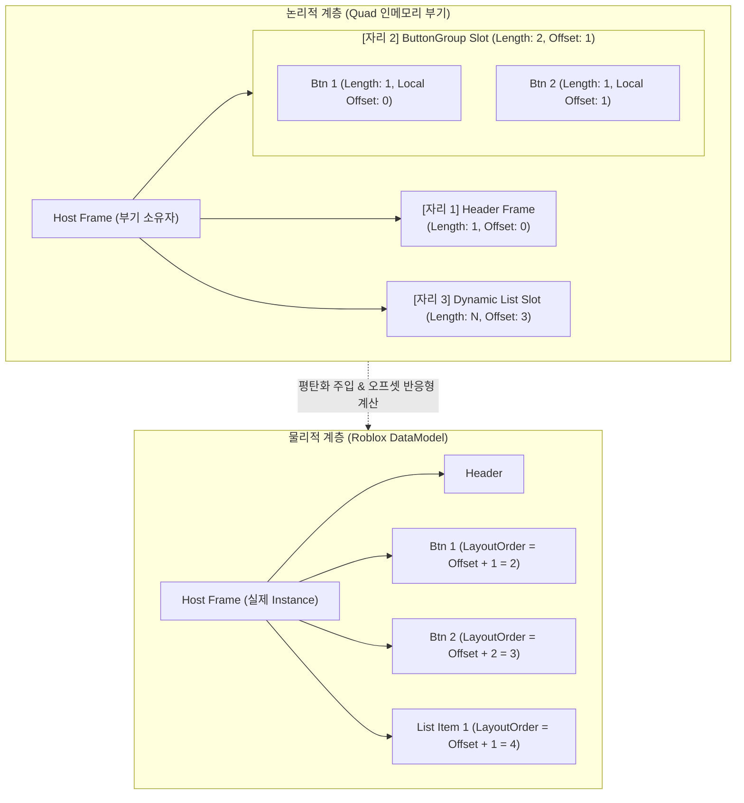

# [Architecture] 웹 프론트엔드 엔지니어를 위한 Quad 심층 비교 가이드: DOMless, Semi-DOM, 그리고 1급 Slot

> **대상 독자**: React, SolidJS, Svelte, Lit 등 웹 프론트엔드 프레임워크에 익숙하며, Roblox 기반 UI 렌더러인 **Quad**의 내부 구조(Bookkeeping, Slot, Reactive Dispatch)를 깊이 이해하고자 하는 엔지니어.  
> **목적**: 웹의 멘탈 모델(Virtual DOM, Template Hole, Web Components `<slot>`)과 Quad의 멘탈 모델(DOMless, 1급 Slot 컨테이너, Prefix-Sum 부기 트리) 사이의 구조적 차이와 역사적 맥락을 명확히 대조하고 해설합니다.

---

## 1. 들어가는 말: "DOMless라는데 왜 트리가 있는가?"

Quad를 처음 접한 웹 개발자는 공식 문서의 **"가상 DOM이 없는 DOMless UI 렌더러"**라는 설명을 보고 Svelte나 SolidJS 같은 완전한 리액티브 직접 바인딩(Direct Binding)을 떠올리기 쉽습니다.

그러나 소스 코드(`Bookkeeping.luau`, `Slot/` 서브시스템)를 분석해 보면 다음과 같은 의문에 직면합니다:

> *"가상 DOM이 없다면서 왜 내부에 `lengthList`, `sourceList`, `indexOfElement`, `offsetCache` 같은 방대한 부기(Bookkeeping) 장부가 존재하는가?"*  
> *"이건 사실상 논리적 노드 계층을 관리하는 **Semi-DOM(가상 범위 트리)**이 아닌가? 그리고 `Slot` 알고리즘이 그 가상 트리 구조를 작동시키는 핵심 런타임이 아닌가?"*

**결론부터 말하면 이 의문은 기술적으로 완전히 옳습니다.**

Quad는 프로퍼티 바인딩 차원에서는 완전한 DOMless(Direct Reactive Binding)를 달성했지만, **자식 노드(Children), 다중 형제 반환(Fragment), 동적 리스트(Reconcile)**라는 구조적 문제를 풀기 위해 **'수치적 부분합(Prefix Sum) 기반의 1급 논리적 범위 트리(Range Tree)'**를 내부에 필연적으로 구축했습니다.

웹 프레임워크들의 역사와 비교하여 Quad가 왜 이런 구조를 가지게 되었는지 단계별로 파헤쳐 봅니다.

---

## 2. 웹 프레임워크의 역사: "형제 여럿(Fragment)"과 "동적 범위(Range)"를 다뤄온 방식

선언형 UI에서 **"래퍼 태그(`<div>`)를 추가하지 않고 형제 여럿을 반환하거나, 리스트의 특정 구간만 동적으로 갱신하는 문제"**는 웹 생태계에서도 지난 15년간 가장 치열하게 다뤄온 난제였습니다.

```
[웹 프레임워크의 진화 계보]

1. Knockout.js (2010~) ────> 주석 기반 "가상 요소(Virtual Elements)" (최초의 DOMless 범위 관리)
2. React (2013~)       ────> Full Virtual DOM (<React.Fragment>, 전체 트리 diffing)
3. lit-html / Lit (2017~) ──> 정적 템플릿 + ChildPart 주석 경계 (Template Hole 기반 부분 트리)
4. Svelte (2016~)      ────> 컴파일러 생성 Block Tree (if_block / each_block)
5. SolidJS (2018~)     ────> Fine-grained Signal + Comment Marker + reconcileArrays
6. Quad (Roblox)       ────> 물리적 마커가 없는 환경에서의 혁신:
                             "1급 가변 Slot 컨테이너" + "수치적 부분합(Prefix Sum) 부기 트리"
```

### (1) Knockout.js (2010): 주석 기반 가상 요소(Virtual Elements)의 시초
웹에서 레이아웃을 깨뜨리는 래퍼 `<div>` 없이 형제 여럿을 제어하려 한 최초의 시도는 Knockout.js의 컨테이너리스 문법(Containerless syntax)이었습니다.
```html
<ul>
    <li>고정 헤더</li>
    <!-- ko foreach: items -->
        <li data-bind="text: name"></li>
    <!-- /ko -->
</ul>
```
Knockout은 `document.createComment()`로 생성되는 **주석 노드(`Comment Node`)를 가상 DOM 요소(Virtual Element)**로 취급하는 런타임(`ko.virtualElements`)을 구현했습니다. 두 주석 사이의 DOM 노드들을 논리적 서브트리로 인식하고 바인딩을 주입했습니다.

### (2) React (2013~): Virtual DOM과 `<React.Fragment>`
React는 문제를 완전히 다른 차원으로 가져갔습니다. 실제 DOM을 직접 다루는 대신, 모든 컴포넌트 호출마다 메모리에 경량 객체인 **Virtual DOM(VNode) 트리**를 생성했습니다.
* `<React.Fragment>` (`<></>`)는 VNode 트리를 빌드할 때 자식 배열을 평탄화(Flatten)하여 상위 VNode의 자식 리스트에 합치는 방식으로 동작합니다.
* 장점: 어떤 형태의 조건부 렌더링이나 형제 반환도 코드 한 곳에 선언적으로 기술됩니다.
* 대가: 상태 하나가 바뀔 때마다 전체 서브트리의 VNode를 새로 생성하고, 이전 트리와 비교하는 Reconciliation(diffing) 비용을 지불해야 합니다.

### (3) Google Lit / lit-html (2017~): 템플릿 구멍(Hole)과 `ChildPart`
구글의 Lit은 Virtual DOM을 전면 부정하고 브라우저 네이티브 `<template>`과 태그드 템플릿 리터럴(`html\`...\``)을 사용합니다.
* 템플릿 안의 동적 표현식 `${...}` 자리마다 **`ChildPart`** 객체를 생성합니다.
* DOM에 `startNode: <!--?lit$-->`와 `endNode` 주석을 심고 그 사이를 관할합니다.
* 배열이나 중첩 템플릿이 들어오면 `ChildPart` 내부에 `ChildPart[]`가 매달리는 **가상 파트 트리(Part Tree)**가 메모리에 형성됩니다.

### (4) SolidJS (2018~): Fine-grained Signals와 Comment Marker
SolidJS는 VDOM 없이 신호(Signals) 기반의 직접 DOM 갱신을 수행하지만, 리스트나 조건부 자식에서는 웹 주석 마커를 사용합니다.
* 컴포넌트가 Fragment(복수의 DOM 노드)를 반환할 때, DOM에는 `<!--#-->`와 `<!--/-->`라는 주석 노드가 앵커로 심어집니다.
* 내부 런타임 함수인 `insert()`는 이 마커들 사이에 존재하는 실제 DOM 노드들의 배열 레퍼런스를 클로저로 들고 있습니다.
* 배열이 바뀌면 `reconcileArrays`가 두 마커 사이의 노드들만 LIS(Longest Increasing Subsequence) 기반으로 최소 이동/교체합니다.

---

## 3. 치명적인 동음이의어: 웹의 `<slot>` vs Quad의 `Slot`

웹 개발자가 Quad를 배울 때 가장 크게 오해하는 지점이 바로 **'슬롯(Slot)'**이라는 단어입니다. 이름은 같지만, **설계 방향과 철학이 정반대(Inverted)**입니다.

```
[웹 컴포넌트 / 프레임워크의 Slot]              [Quad의 Slot]
   (수동적 템플릿 플레이스홀더)                     (능동적 1급 논리 컨테이너)

   <my-card>                                      local items = q.Slot { ... }
     ┌──────────────────────┐                       │ (상위에서 만들어 넘김)
     │ [Slot: default]      │ <── 외부 자식 주입       ▼
     │ (구멍이 뚫려 있음)     │                     MyCard {
     └──────────────────────┘                         Children = items  <── 슬롯 자체를 수신
                                                    }
```

### (1) 웹의 Slot: "자식이 꽂힐 자리를 뚫어놓은 수동적 구멍(Placeholder)"
* Web Components의 `<slot>` 태그나 Vue/Svelte의 `<slot />`은 컴포넌트 **내부**에 선언됩니다.
* 역할: "외부에서 전달된 자식 요소를 섀도우 트리/내부 트리의 이 위치에 투영(Project)해 달라"는 **정적 플레이스홀더**입니다.
* 개발자가 런타임에 slot 객체를 변수에 담아 `:Add()`, `:Move()`, `:Splice()` 같은 조작을 가할 수 없습니다.

### (2) Quad의 Slot: "상위에서 만들어 넘겨주는 능동적 1급 다층 컨테이너"
Quad의 `Slot`은 템플릿 구멍이 아니라, **독립적인 생명주기와 상태를 가진 1급 객체(First-Class Citizen)**입니다.

1. **상위에서 생성하여 하위로 주입 (Inverted Direction)**:
   Quad에서는 상위 컴포넌트(호출부)가 `q.Slot { ... }`을 직접 생성하여 하위 컴포넌트의 props(`props.Children`)로 넘겨줍니다. 하위 컴포넌트는 그 슬롯을 자기 반환 인스턴스의 숫자 키 자리에 꽂아 넣습니다.
2. **다층 구조 (Slot-in-Slot)**:
   Slot은 단일 인스턴스뿐만 아니라 **또 다른 Slot을 자식으로 품을 수 있습니다.** 컴포넌트가 반환한 `ButtonGroup` 슬롯이 상위 리스트 슬롯의 한 항목이 되고, 그것이 다시 최상위 패널 슬롯의 한 항목이 되는 무한 중첩이 완전히 합법적입니다.
3. **지연 활성화 (Lazy Materialization)**:
   Slot은 실제 물리 인스턴스에 마운트되기 전에도 메모리 상에 온전히 존재합니다(`unmaterialized`). 마운트 전에는 가벼운 원소 배열(`_elements`)만 유지하다가, 실제 인스턴스에 연결되는 순간(`materializeSlotTree`) 비로소 부기(Bookkeeping) 장부를 펴고 반응형 옵저버를 가동합니다.
4. **물리적 트리에서의 완전한 소멸 (DOMless의 실체)**:
   Roblox의 실제 인스턴스 트리(`DataModel`)를 들여다보면 **`Slot`이라는 객체는 흔적도 없이 사라져 있습니다.**
   Slot이 품고 있던 10개의 버튼은 부모 `Frame` 아래에 평탄한(Flat) 형제 인스턴스로 직접 마운트됩니다. 물리적으로는 어떤 래퍼 인스턴스나 마킹도 남지 않습니다.

---

## 4. 아키텍처 핵심 분기점: 왜 웹은 '주석 포인터'를 썼고, Quad는 '부분합(Prefix Sum) 부기 트리'를 만들었는가?

이 부분이 웹과 Quad의 아키텍처를 가르는 가장 본질적인 엔지니어링 차이점입니다.

### (1) 웹 DOM 환경의 엄청난 특권
웹 브라우저는 1990년대부터 **포인터(참조) 기반의 연결 리스트 트리** 모델을 가지고 있었습니다.
* **`document.createComment()`**: 렌더링 트리(Layout/Painting)에 전혀 영향을 주지 않는 완전 무해한 '마커 노드'를 DOM 트리에 마음껏 심을 수 있습니다.
* **`parent.insertBefore(newNode, referenceNode)`**: "몇 번째 인덱스"라는 숫자가 필요 없습니다. 단지 **"어느 노드 앞"이라는 객체 참조(포인터)**만 있으면 정확한 위치에 삽입됩니다.

따라서 Lit이나 SolidJS 같은 웹의 DOMless 프레임워크들은 **수학적 계산을 할 필요가 없습니다.**
앞선 형제 컴포넌트의 자식이 1개에서 1,000개로 늘어나든 말든, 내 컴포넌트의 시작 마커(`<!--start-->`)와 끝 마커(`<!--end-->`) 포인터만 쥐고 있으면 브라우저가 알아서 공간을 벌려줍니다.

### (2) Roblox 엔진의 가혹한 제약
Roblox 환경은 웹 DOM과 완전히 다릅니다:
1. **주석 노드 같은 무해한 앵커가 없음**: Roblox의 모든 `Instance`는 무거운 C++ 엔진 객체이며, UI 트리에 넣으면 메모리와 렌더링에 실시간으로 영향을 줍니다. 가상의 마커 역할을 할 가벼운 객체가 전무합니다.
2. **참조 기반 삽입 API가 없음**: `insertBefore(newNode, refNode)` 같은 API가 없습니다. 오직 `child.Parent = parent`로 부모를 지정할 뿐이며, 물리적 자식 순서는 엔진 내부의 불투명한 인덱스로 관리됩니다.
3. **화면 순서는 `LayoutOrder` 숫자가 결정함**: UI 정렬 컴포넌트(`UIListLayout` 등)에서 자식들의 표시 순서는 각 인스턴스의 정수 프로퍼티인 `LayoutOrder`에 의해 좌우됩니다.

### (3) Quad의 필연적 선택: 인메모리 부분합(Prefix Sum) 부기 엔진
마커 노드를 트리에 심을 수 없고, 인덱스 기반으로만 자식들의 순서와 범위를 통제할 수 있는 환경에서, 가상 DOM 없이 Fragment와 동적 리스트를 다루려면 어떻게 해야 하는가?

Quad는 **순수 메모리 상에서 수학적인 부분합(Prefix Sum) 트리를 관리하는 독자적인 부기 서브시스템([`Bookkeeping.luau`](file:///code/Projects/quad/quad-base/src/Bookkeeping.luau))**을 구축하는 해법을 선택했습니다.



1. **`lengthList`**: 각 자리(Position)가 차지하는 물리 자식의 수(길이). 상수일 수도 있고, 반응형 `State<number>`일 수도 있습니다.
2. **`sourceList`**: 각 자리에 자신의 절대 시작 위치를 전달할 `Source<number>` 채널. 자식 Slot은 이 채널을 통해 자신의 `Offset`을 공급받습니다.
3. **`getOffsetAt(ownerKey, at)`**: 특정 자리가 시작되는 물리적 위치를 구하기 위해, 앞선 자리들의 길이를 누적합산(Prefix Sum)합니다.
4. **리액티브 전파와 커서 캐싱**: 앞선 `ButtonGroup`의 버튼이 2개에서 3개로 늘어나면:
   * `ButtonGroup.Length` State가 3으로 변경됩니다.
   * 상위 부모의 부기 관측자(`observers`)가 이를 감지하고 캐시 커서(`offsetCacheValidUpTo`)를 되감습니다.
   * 뒤따르는 `Dynamic List Slot`의 `Offset` Source가 3에서 4로 반응형 업데이트됩니다.
   * 리스트 내부의 아이템들은 `ctx.Offset`을 구독하여 자신의 `LayoutOrder`를 동기적으로 재조정합니다.

---

## 5. 개념 비교 요약 매트릭스

| 비교 축 | React (Full VDOM) | Lit (lit-html) | SolidJS | Quad (DOMless + 1급 Slot) |
| :--- | :--- | :--- | :--- | :--- |
| **프로퍼티 갱신** | VNode diffing 후 반영 | 바인딩 표현식 직접 갱신 | Signal 직접 갱신 | Signal(State) 직접 갱신 |
| **Fragment 다중 형제** | VNode 배열 평탄화 | 템플릿 인스턴스 중첩 | 마커 사이 노드 배열 클로저 | **1급 `Slot` 컨테이너** |
| **동적 범위 추적 방식** | 가상 DOM 트리 비교 | 주석 노드 (`ChildPart`) | 주석 노드 (`<!--#-->`) | **수치적 부분합 부기 (`Bookkeeping`)** |
| **삽입/삭제 프리미티브** | VNode 트리 재구성 | `Node.insertBefore` | `Node.insertBefore` | `.Parent` 및 부기 오프셋 갱신 |
| **Slot의 정체성** | props.children (VNode) | 템플릿 표현식 구멍 | JSX Children / 렌더 함수 | **자체 CRUD/수명을 가진 가변 상태 머신** |
| **언마운트 시 인스턴스 보존** | 기본적으로 파괴됨 | 수동 캐싱 디렉티브 필요 | 기본적으로 파괴됨 | **`:Extract` / `:Detach`로 인스턴스 보존** |
| **가상 트리(DOM) 존재 여부** | **전면 가상 DOM** | 부분적 파트 트리 | 마커 기반 부분 참조 | **부분합 기반 Semi-DOM (Range Tree)** |

---

## 6. 웹 개발자를 위한 실전 멘탈 모델 전환 가이드

1. **"컴포넌트 반환값으로 형제 여럿을 넘기고 싶다면?"**
   * 웹(React): `<> <Button /> <Button /> </>`
   * Quad: `return q.Slot { D.TextButton { ... }, D.TextButton { ... } }`
   * *주의*: 이 Slot은 래퍼 인스턴스가 아니며, 화면에는 두 버튼만 깨끗하게 마운트됩니다.

2. **"`LayoutOrder`는 프레임워크가 알아서 채워주지 않는가?"**
   * Quad는 마법(Magic)을 거부합니다. 컴포넌트가 선언한 `LayoutOrder = 10`을 조용히 덮어쓰지 않습니다.
   * 대신 Slot의 동적 목록(`:List`)은 `ctx.Index`(슬롯 내 순번)와 `ctx.Offset`(슬롯 시작 위치)이라는 **반응형 재료를 제공**합니다.
   * 개발자는 `LayoutOrder = order:Depend(ctx.Offset):Compute(...)` 형태로 명시적으로 선언합니다.

3. **"데이터 목록은 어떻게 렌더링하는가?"**
   * 웹(React): `{items.map(item => <Card key={item.id} />)}`
   * Quad: 
     ```luau
     local listSlot = q.Slot() -- 빈 상태로 생성 (마운트 시 활성화)
     listSlot:List(dataState, function(ctx)
         return Card { Item = ctx.Item }, { ... }
     end, function(item) return item.id end) -- keyFn
     ```
   * 초기 생성 시에는 비어 있다가, 실제 화면에 부착될 때 비로소 `dataState`를 구독하고 아이템을 채우는 **Lazy Materialization** 모델입니다.

---

## 7. 맺음말

Quad를 **"DOMless"**라고 부르는 것은, **"화면의 모든 프로퍼티와 트리를 VNode로 복제하여 매 프레임 diffing하지 않는다"**는 관점에서 완벽히 참입니다.

동시에 Quad가 **"Semi-DOM을 가진다"**고 보는 것 역시, **"물리 엔진에 주석 마커가 없는 환경에서, 형제들의 동적 범위와 순서를 관리하기 위해 정교한 1급 Slot과 부분합 부기 트리를 유지한다"**는 관점에서 완벽히 참입니다.

웹의 발전사가 "무거운 VDOM에서 가벼운 반응형 마커로" 진화해 왔다면, Quad는 Roblox라는 특수한 엔진 환경의 제약 속에서 **"가장 얇고 수학적인 형태의 논리적 Range 트리"**를 구축함으로써 No-VDOM의 구조적 한계를 돌파한 독창적인 프레임워크입니다.
