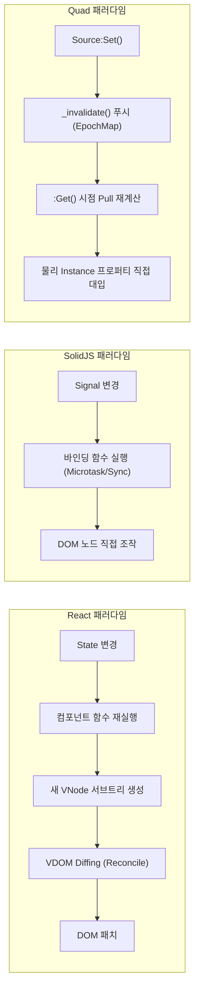
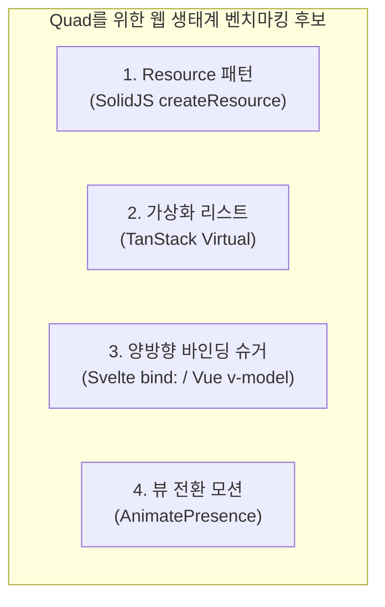

# [Comparative Study] 웹 프레임워크 생태계와 Quad의 아키텍처 비교 & 벤치마킹 분석

> **대상 독자**: React, SolidJS, Vue, Svelte, TanStack 등 현대 웹 프런트엔드 아키텍처에 정통하며, Quad의 현재 기능과 웹 생태계의 성숙한 디자인 패턴을 대조해보고자 하는 프레임워크 개발자 및 사용자.  
> **목적**: 
> 1. 웹 프레임워크들과 Quad의 체감 멘탈 모델 차이를 체계적으로 대조합니다.
> 2. Quad에 **이미 완벽하게 구현되어 있어 재발명할 필요가 없는 기능들**을 팩트체크합니다.
> 3. 웹 생태계의 선진 사례 중 **향후 Quad의 확장(Sugar / Plugin)으로 벤치마킹할 만한 실전 패턴**을 도출합니다.

---

## 1. 프레임워크 멘탈 모델 체감 대조

웹 개발자가 Quad 코드를 처음 볼 때 느끼는 직관적인 감각과 구조적 차이를 요약합니다.



| 관점 | React (Next.js) | SolidJS / Svelte 5 | Quad (Roblox) |
| :--- | :--- | :--- | :--- |
| **컴포넌트의 본질** | **반복 실행되는 렌더 루프**<br>(상태가 바뀔 때마다 함수 전체가 다시 돔) | **단 1회 실행되는 셋업 함수**<br>(함수는 1번만 돌고 바인딩만 남음) | **단 1회 실행되는 셋업 함수**<br>(컴포넌트는 그냥 Instance를 반환하는 일반 함수) |
| **상태 전파 흐름** | 하향식 서브트리 리렌더링 | Fine-grained Push-Pull | **Push 무효화(신호) + `:Get()` Pull 재계산** |
| **훅(Hook) 규칙** | **엄격한 호출 순서 규칙**<br>(조건문/루프 안에서 훅 호출 불가) | 훅 규칙 없음 | **훅 규칙 전혀 없음**<br>(평범한 Lua 값들의 합성) |
| **갱신 오버헤드** | VNode 트리 생성 및 Diffing | 미세 바인딩 클로저 호출 | **순수 정수 비교 및 속성 대입** |

---

## 2. 팩트체크: Quad에 이미 정교하게 존재하는 웹급 기능들

웹 개발자가 *"이런 기능도 있나?"* 하고 새로 만들거나 제안하기 쉽지만, **이미 Quad 코어 및 슈거 레이어에 극도로 정교하게 내장되어 있는 핵심 기능들**입니다.

### (1) 배치 트랜잭션 (Batching & Transaction)
* **웹**: React 18의 Automatic Batching, SolidJS의 `batch(() => { ... })`.
* **Quad**: 
  * [`q.Blocker()`](file:///code/Projects/quad/quad-base/src/Blocker.luau)와 [`q.Gate()`](file:///code/Projects/quad/quad-base/src/Gate.luau)가 이미 1급 객체로 존재합니다.
  * `blocker:On()`을 걸면 변경 신호가 보류(withheld)되고, `blocker:Off()` 시점에 단 1회의 파동으로 일괄 방출됩니다.
  * 심지어 `blocker:OffWithoutEmit()`을 통해 보류된 변경사항을 **흔적도 없이 통째로 폐기(Discard)**할 수도 있습니다.
  * `Slot`의 대규모 삽입/삭제([`rawSplice`](file:///code/Projects/quad/quad-base/src/Slot/Raw.luau)) 역시 내부적으로 이 Blocker를 써서 물리 연산을 단 1회로 접습니다.

### (2) 에러 바운더리와 하위 트리 격리 (Error Boundary)
* **웹**: React의 `<ErrorBoundary fallback={<ErrorUI />}>`.
* **Quad**: 
  * [`q.Fallback(uiFactory, fallbackFactory)`](file:///code/Projects/quad/quad-base/src/Fallback.luau)이 존재합니다.
  * 중요한 점은 웹처럼 래퍼 DOM을 덧씌우지 않고, 생성 도중 에러가 발생하면 백트레이스를 캡처한 뒤 폴백 UI를 대신 마운트합니다.

### (3) 디바운스와 쓰로틀 (Debounce & Throttle)
* **웹**: Lodash `debounce`, RxJS `debounceTime`, 커스텀 훅 `useDebounce`.
* **Quad**:
  * [`q.Debounce(source, delay)`](file:///code/Projects/quad/quad-base/src/Debounce.luau)와 `q.Throttle(source, delay)`가 1급 반응형 State 래퍼로 완벽히 구현되어 있습니다.
  * 입력이 고빈도로 들어와도 내부 타임스탬프와 태스크 캔슬레이션을 통해 정확한 틱에만 하류로 전파됩니다.

### (4) 신호 콤비네이터 (Reactive Combinators)
* **웹**: RxJS의 `map`, `filter`, `combineLatest`.
* **Quad**:
  * [`q.Operator`](file:///code/Projects/quad/quad-base/src/Operator.luau) 모듈이 제공됩니다.
  * `state:Apply(Operator.Clamp(0, 100))`, `state:Apply(Operator.Not)`, `state:Apply(Operator.Sum(a, b))` 등 자주 쓰이는 산술·불리언 연산이 의존성 누락 없이 타입 안전하게 합성됩니다.

### (5) 명시적 의존성 주입 (Context)
* **웹**: React `createContext` / `useContext` (트리를 거슬러 올라가는 암묵적 스캔).
* **Quad**:
  * [`q.Context()`](file:///code/Projects/quad/quad-base/src/Context.luau)가 존재합니다.
  * 단, 렌더 트리가 없는 Quad의 특성상 트리를 거슬러 올라가는 런타임 탐색 대신, 컴포넌트 경계를 건너뛸 때 이름을 줄여주는 **명시적 가방(Explicit Bag)** 역할을 수행합니다.

---

## 3. 웹 생태계에서 벤치마킹해볼 만한 미래 패턴들

Quad에 현재 없거나, 향후 플러그인 또는 확장 슈거 라이브러리 형태로 도입을 검토해볼 만한 웹의 성숙한 설계 패턴들입니다.



### (1) 비동기 코루틴 결합: SolidJS의 `createResource` 패턴
* **웹의 현주소**:
  SolidJS는 비동기 데이터 패칭(API 호출, 비동기 로딩)을 반응형 시그널과 결합한 `createResource`를 제공합니다:
  ```javascript
  const [data, { mutate, refetch }] = createResource(userId, fetchUserData);
  // data()       -> 현재 로드된 값
  // data.loading -> 로딩 중 여부 (boolean Signal)
  // data.error   -> 에러 객체 (Signal)
  ```
  * 특징: 이전 요청이 끝나기 전에 `userId`가 바뀌면, 이전 응답을 버리고 최신 요청만 반영하는 **경쟁 상태 방지(Race Condition Guard)**가 내장되어 있습니다.
* **Quad의 현재와 기회**:
  * Quad는 완벽한 동기(Synchronous) 그래프입니다. Roblox에서 비동기 작업(DataStore, HttpService, Asset 로딩)은 전부 Luau 코루틴(`task.spawn`)으로 일어납니다.
  * 현재 사용자는 `loading`, `data`, `error` 3개의 `Source`를 직접 만들고 `task.spawn` 안에서 수동으로 채워야 합니다.
  * **벤치마킹 아이디어**:  
    `q.Resource(fetcherFn, sourceDep)` 형태의 슈거를 만들 수 있습니다.  
    상류 소스가 바뀔 때 이전 코루틴을 `task.cancel`하고, `Data`, `Loading`, `Error`를 담은 복합 State를 돌려주는 패턴은 실무 생산성을 비약적으로 높일 수 있습니다.

---

### (2) 대규모 데이터 가상화 (Virtualization / Windowing): TanStack Virtual 패턴
* **웹의 현주소**:
  수천 개의 데이터 항목을 렌더링할 때 DOM 노드를 수천 개 만들면 브라우저가 정지합니다. TanStack Virtual은 **"실제 화면에 보이는 10~20개 항목만 DOM에 올리고, 위아래는 빈 여백(Padding)으로 채우는 윈도잉 기술"**을 씁니다.
* **Quad의 현재와 기회**:
  * Quad의 `Slot:List`는 데이터가 1,000개이면 실제 Roblox `Instance`를 1,000개 전부 생성합니다.
  * Roblox GUI 엔진도 인스턴스가 수천 개로 늘어나면 `UIListLayout`의 계산 부하와 메모리 점유율이 급증합니다.
  * **프로젝트 현황**: 이미 Quad 내부 로드맵/계획에 **"fast scroll"** 관련 제안으로 윈도잉/가상화 리스트에 대한 설계 검토가 올라가 있습니다.
  * **구조적 장점**: Quad의 `Slot`은 물리적 마운트 없이도 `Offset`과 `Length`를 가상으로 부기(`Bookkeeping`)할 수 있는 Range 구조이므로, 타 라이브러리에 비해 가상화 리스트(Virtualized List)를 결합하기에 구조적으로 매우 유리합니다.

---

### (3) 입력 요소 양방향 바인딩: Svelte의 `bind:` 및 Vue의 `v-model`
* **웹의 현주소**:
  웹 폼(Form) 요소에서 입력값을 상태와 동기화할 때 양방향 바인딩 슈거를 씁니다:
  ```svelte
  <input bind:value={text} />
  ```
* **Quad의 현재와 기회**:
  * 현재 Quad에서 `TextBox`를 바인딩하려면:
    ```luau
    D.TextBox {
        Text = text,
        OnChange = {
            Text = function(newText) text:Set(newText) end,
        },
    }
    ```
  * 프로퍼티 바인딩과 이벤트 핸들러를 매번 2벌로 작성해야 합니다.
  * **벤치마킹 아이디어**:  
    Quad의 디스패치 엔진은 런타임 확장이 열려 있습니다(`Dispatch.addHandler`).  
    `q.Bind(source)`라는 특수 값 타입을 핸들러로 등록해 두면:
    ```luau
    D.TextBox {
        Text = q.Bind(text), -- 값 설정과 OnChange 이벤트 구독을 1타 쌍피로 처리!
    }
    ```
    한 줄로 양방향 동기화가 끝나는 아름다운 슈거를 라이브러리 코어 수정 없이 구현할 수 있습니다.

---

### (4) 뷰 전환과 퇴장 애니메이션: Framer Motion의 `<AnimatePresence>` 패턴
* **웹의 현주소**:
  웹에서 요소가 화면에서 사라질 때(Unmount) 페이드아웃 애니메이션을 보여주려면, 실제 DOM에서 즉시 제거하지 않고 애니메이션이 끝날 때까지 DOM 트리에 붙잡아 두어야 합니다. Framer Motion의 `<AnimatePresence>`가 이 역할을 담당합니다.
* **Quad의 현재와 기회**:
  * Quad의 `Slot`은 원소가 빠지면 기본적으로 즉시 파괴하거나 추출합니다.
  * 그러나 Quad 내부에는 이미 [`rawDetach`](file:///code/Projects/quad/quad-base/src/Slot/Raw.luau#L178)라는 **"인스턴스를 즉시 파괴하지 않고 슬롯의 소유권 하에 보류(Hold)하는 메커니즘"**이 갖추어져 있습니다.
  * **벤치마킹 아이디어**:  
    퇴장 애니메이션(`Tween`)이 끝나는 시점까지 `Detach` 상태로 유지했다가, 애니메이션 완료 콜백에서 비로소 슬롯에서 영구 제거하는 **"Animated Slot Presence"** 헬퍼를 구축할 수 있습니다.

---

## 4. 총평

웹 생태계가 지난 수년간 수많은 시행착오를 거치며 정립해 온 "Push-Pull 리액티비티", "트랜잭션 게이팅", "선언형 셋업 컴포넌트" 등의 핵심 아키텍처는 **이미 Quad의 심장부에 놀라울 정도로 정밀하게 구현**되어 있습니다.

Quad가 앞으로 나아갈 수 있는 확장의 영역은 코어 렌더링 엔진이 아니라, **비동기 코루틴과의 결합(Resource), 대규모 뷰포트 가상화(Virtualization), 그리고 폼 바인딩 편의성(Two-way Binding)** 같은 **"실무 응용 레이어의 슈거(Sugar)"**들입니다.

Quad의 극도로 유연한 **열린 디스패치 엔진**과 **1급 Slot 컨테이너**는 이러한 웹의 고급 패턴들을 흡수하기에 가장 이상적인 토대를 이미 완성해 두고 있습니다.
