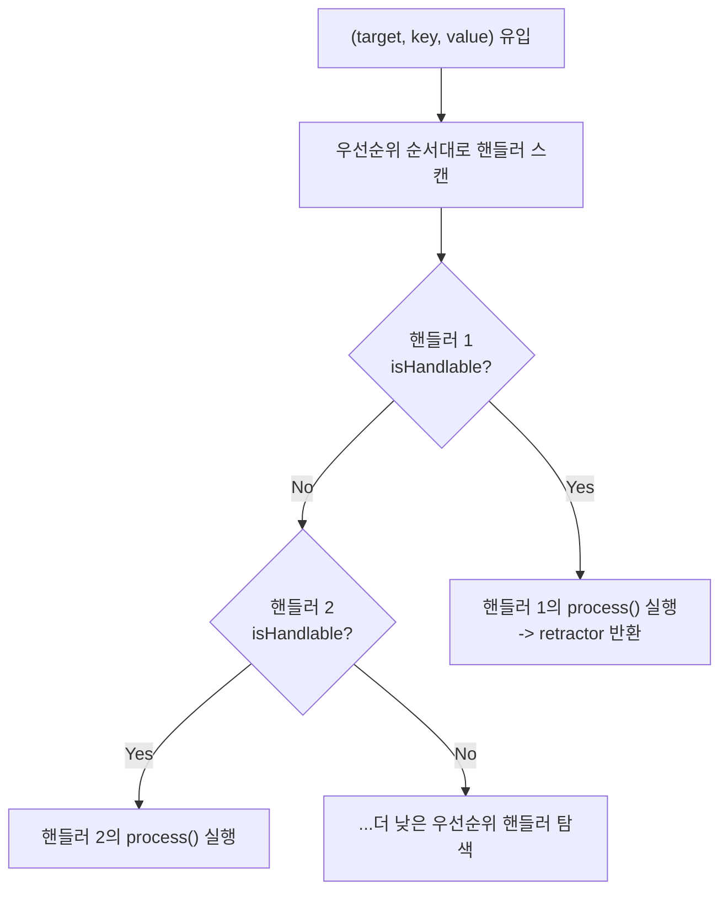

# [Architecture Deep Dive] 생명주기(GC·수명 관리)와 열린 디스패치 엔진: React/Solid/Web Standards vs Quad

> **대상 독자**: React의 `useEffect`, SolidJS의 `createRoot`/`onCleanup`, Web 표준 `AbortController` 등의 수명 관리 패턴과 Web 컴포넌트 확장 모델에 익숙한 웹 엔지니어.  
> **목적**: Quad가 어떻게 "정리(Cleanup)를 위한 스코프 객체를 완전히 없앴는지", 그리고 "props 처리기가 프레임워크 코어에 하드코딩되지 않고 런타임에 완전히 열려 있는 구조(Open Dispatch Engine)"를 어떻게 실현했는지 비교 분석합니다.

---

## 1. 생명주기(Lifetime): "정리할 스코프 객체가 없다"의 진정한 의미

웹 프레임워크에서 개발자가 작성하는 코드의 상당 부분은 **"언마운트될 때 메모리 누수 없이 리소스를 어떻게 정리할 것인가(Cleanup Plumbing)"**에 집중되어 있습니다.

```
[웹 프레임워크의 수명 정리 배관]

React:      useEffect(() => {
                const sub = store.subscribe(...);
                return () => sub.unsubscribe(); // 수동 cleanup 함수 반환 필수
            }, []);

SolidJS:    createRoot((dispose) => {
                onCleanup(() => sub.unsubscribe()); // 렉시컬 스코프 기반 cleanup 등록
            });

Web 표준:   const controller = new AbortController();
            window.addEventListener('resize', handler, { signal: controller.signal });
            // 나중에 controller.abort() 호출 필수
```

과거 Roblox 선언형 UI(Fusion 등) 역시 웹의 패턴을 모방하여 `Scope`라는 배열 객체를 만들고, 모든 컴포넌트 함수마다 `scope:add(...)`를 인자로 질질 끌고 다니는 고통스러운 배관 작업을 요구했습니다.

하지만 Quad의 컴포넌트 코드를 보면 **그 어떤 스코프 객체도, `useEffect` 같은 뒤처리 클로저도 존재하지 않습니다.**

```luau
-- Quad 카운터 컴포넌트: 정리 코드가 한 줄도 없다!
return function(props)
    local count = q.Source(0)
    return D.Frame {
        D.TextLabel {
            Text = count:Compute(function(c) return `Count: {c:Get()}` end),
        },
        D.TextButton {
            Activated = function() count:Set(count:Get() + 1) end,
        }
    }
end
```

도대체 Quad는 인스턴스가 파괴될 때 옵저버와 반응형 연결을 어떻게 정리하고 메모리 누수를 막는 것일까요?

---

## 2. Quad의 역발상: C++ 엔진 커넥션을 이용한 '동기적 자가 티어다운'

비밀은 [`quad-roblox/src/LifetimeHandle.luau`](file:///code/Projects/quad/quad-roblox/src/LifetimeHandle.luau)에 구현된 **`nativeClaim`** 메커니즘에 있습니다.

### (1) Roblox 특유의 함정: UserData 신원 유실
Roblox의 `Instance`는 C++ 엔진 객체를 가리키는 Lua `userdata` 포인터입니다.
치명적인 문제는, **화면 트리에 멀쩡히 살아있는 인스턴스라도 Lua 쪽에서 아무도 참조하지 않으면 단 한 번의 GC 사이클 만에 userdata가 회수되어 버린다**는 점입니다. 나중에 같은 인스턴스를 다시 조회하면 **완전히 다른 주소의 새 userdata**가 반환됩니다.
이로 인해 약참조 맵(`Relate`)에 매달린 반응형 장부 전체가 조용히 미아가 되는 대재앙이 발생합니다.

### (2) C++ 엔진을 인질로 잡는 `gcconn` 핀(Pin) 패턴
Quad는 인스턴스가 생성되는 순간 다음 코드를 단 한 번 실행합니다:

```luau
-- quad-roblox/src/LifetimeHandle.luau 발췌
local gchold: { [any]: any } = {}
local gcconn = inst:GetPropertyChangedSignal("ClassName"):Connect(function()
    nop(gchold, inst) -- 절대 실행되지 않음! 캡처 자체가 목적
end)
gchold[1] = gcconn
```

* `ClassName`은 인스턴스 수명 동안 절대 변하지 않으므로 이 이벤트는 영원히 발화하지 않습니다.
* 그러나 **Roblox C++ 엔진은 연결된 이벤트 콜백을 강하게 참조**합니다.
* 그 콜백 클로저가 `gchold` 테이블과 `inst`를 업밸류(upvalue)로 캡처하고 있습니다.
* 결과적으로 **C++ 엔진이 Lua userdata와 `gchold`의 메모리를 강제로 고정(Pin)**시킵니다!

### (3) `Destroy()`와 동시에 일어나는 동기적 전원 차단
인스턴스가 수명을 다해 `inst:Destroy()`가 호출되면:
1. Roblox 엔진이 내부적으로 연결된 이벤트 커넥션들을 즉시 끊어버립니다 (`gcconn.Connected == false`).
2. Quad의 생존 판정 함수인 `isBoundAlive()`는 `gcconn.Connected`를 검사하므로, **파괴되는 그 순간 동기적으로 모든 후속 반응형 발화가 게이트에서 원천 차단**됩니다.
3. 엔진의 참조가 끊겼으므로 `gchold`와 그 안에 `bindLifetime`으로 묶여 있던 모든 반응형 옵저버, 이벤트 리스너들이 **다음 Luau GC 사이클에 한꺼번에 자연 수거**됩니다.

#### [치른 대가와 트레이드오프]
* **산 것**: 개발자가 스코프 객체나 `onCleanup`을 들고 다닐 필요가 100% 사라졌습니다.
* **치른 대가**: Quad가 만든 인스턴스는 단순 변수 참조를 `nil`로 놓는 것만으로는 회수되지 않으며, **반드시 `inst:Destroy()`나 `q.dispose(inst)`를 통해서만 회수**됩니다.

---

## 3. 열린 디스패치 엔진 (Open Dispatch Engine): 프레임워크 코어를 털어내다

웹 개발자에게 가장 익숙한 Virtual DOM의 props 패치 구조는 다음과 같습니다:

```typescript
// 일반적인 Virtual DOM의 patchProp 내부 (하드코딩된 분기)
function patchProp(el, key, value) {
    if (key.startsWith('on')) {
        patchEvent(el, key.slice(2), value);
    } else if (key === 'style') {
        patchStyle(el, value);
    } else if (key === 'class') {
        patchClass(el, value);
    } else {
        el.setAttribute(key, value);
    }
}
```
웹 프레임워크에서는 프레임워크 작성자가 정해놓은 `on*`, `style`, `class` 외에 **새로운 props 어휘나 새로운 값 타입을 라이브러리 수정 없이 추가하는 것이 사실상 불가능**합니다. (Vue의 커스텀 디렉티브나 Svelte의 `use:action`도 DOM 노드 수준의 훅일 뿐, props 파이프라인 자체를 가로채지는 못합니다.)

### (1) Quad의 해법: 우선순위 기반 열린 핸들러 레지스트리
Quad의 코어인 [`quad-base/src/Dispatch/init.luau`](file:///code/Projects/quad/quad-base/src/Dispatch/init.luau)는 **Roblox라는 엔진의 존재 자체를 아예 모릅니다.**

`D.Frame { ... }`의 중괄호 안에 들어오는 모든 `(요소, 키, 값)` 삼총사는 디스패치 엔진의 핸들러 레지스트리를 통과합니다:



핸들러는 순수 함수와 레코드로 구성됩니다:
```luau
type Handler = {
    priority: number,                                   -- 열린 숫자 우선순위
    keyType: "string" | "number" | "any",               -- 키 버킷 최적화
    isHandlable: (inst: any, key: any, value: any) -> boolean, -- 순수 판별
    process: (inst: any, key: any, value: any) -> Retractor,   -- 처리 및 철거기 반환
}
```

### (2) 백엔드조차 '플러그인 손님'에 불과하다
Quad에서 Roblox의 네이티브 프로퍼티를 설정하는 `PropertyHandler`, 이벤트를 연결하는 `EventHandler`, `OnChange` 핸들러는 코어의 특권이 아닙니다.  
**`q:UseProvider(QuadRoblox)`를 호출할 때 공개 경로(`q.Dispatch.addHandler`)를 통해 등록된 평범한 핸들러들에 불과합니다.**

* `Tween`: 프로퍼티 핸들러가 소비하는 특수한 값 타입 핸들러.
* `Modifier`: 인라인 props 이전에 정적으로 평탄화되는 래핑 핸들러.
* `Slot`: 숫자 키 자리를 가로채는 자식 컨테이너 핸들러.
* `Ref`: 인스턴스가 만들어진 직후 참조를 주입하는 훅 핸들러.

사용자는 프레임워크 코드를 포크(Fork)하지 않고도, 언제든지 `priority = 150`을 가진 나만의 커스텀 핸들러(예: 스프링 물리 값 핸들러, 접근성 자동 부여 핸들러 등)를 추가하여 `D.Frame { MySpecialKey = ... }` 문법을 프레임워크 기본 기능처럼 확장할 수 있습니다.

---

## 4. 스타일 모델의 차이: CSS/Tailwind vs Quad의 `Modifier`

웹에서의 스타일링은 **CSS 캐스케이드(Cascade) 엔진**에 크게 의존합니다.

* **CSS / CSS-in-JS**: 브라우저나 런타임이 선택자 우선순위(Specificity)와 상속 규칙을 매번 계산합니다.
* **Tailwind CSS**: 유틸리티 클래스를 컴파일 타임에 정적 CSS로 변환하여 런타임 계산을 없앱니다.

Quad는 Roblox에 스타일시트가 없다는 점을 역이용하여, **Zero-runtime 딕셔너리 합성 모델인 `Modifier`**를 채택했습니다.

```luau
local CommonButton = D.Modifier.Frame {
    BorderSizePixel = 0,
    BackgroundColor3 = Color3.fromRGB(50, 50, 50),
}

local DangerButton = D.Modifier.Frame {
    CommonButton, -- 다른 Modifier를 합성(상속)
    BackgroundColor3 = Color3.fromRGB(220, 50, 50), -- 덮어쓰기
}

D.TextButton {
    DangerButton,                     -- 숫자 키: 스타일 적용
    BackgroundColor3 = Color3.fromRGB(255, 0, 0), -- 인라인 키: 최종 승리!
}
```

* **런타임 캐스케이드 제로**: Modifier는 디스패치 엔진에 들어가기 전, 컴포넌트 셋업 시점에 **단순 딕셔너리 병합(Merge)**으로 평탄화됩니다.
* **우선순위 규칙의 단순함**:
  1. `숫자 키 자리에서 뒤에 선언된 것이 앞의 것을 덮어쓴다.`
  2. `인라인 문자 키(프로퍼티)는 Modifier를 무조건 이긴다.`
* 복잡한 CSS 명시도(Specificity) 싸움 없이, O(1) 테이블 룩업으로 스타일이 결정됩니다.

---

## 5. 최종 결론 및 매트릭스

| 아키텍처 축 | 웹 프레임워크 (React / SolidJS / Lit) | Quad (Roblox) |
| :--- | :--- | :--- |
| **수명 정리 메커니즘** | 컴포넌트 스코프 객체, `useEffect` cleanup 반환, `AbortSignal` 수동 연결 | **엔진 커넥션 기반 `nativeClaim` 자가 티어다운 (스코프 객체 없음)** |
| **인스턴스 회수 조건** | 가비지 컬렉터의 참조 도달 불가능성 (GC 도달성) | **반드시 `Destroy()` 호출이 유일한 절단면** (신원 고정 대가) |
| **확장 모델 (Props)** | 하드코딩된 `patchProp`, 제한적인 Directives | **열린 숫자 우선순위 기반 디스패치 파이프라인 (`Dispatch.addHandler`)** |
| **코어와 플랫폼 결합** | 프레임워크가 DOM API(`document`, `Element`)에 강결합 | **코어(`quad-base`)는 엔진을 모름 (`UseProvider` 부착식)** |
| **스타일 처리** | CSS 룰셋, 런타임 캐스케이드 계산, 컴파일 타임 클래스 매핑 | **정적으로 평탄화되는 불변 딕셔너리 (`Modifier`)** |

Quad는 웹의 선언형 패러다임을 이어받으면서도, **"스코프 배관을 완전히 지운 메모리 토폴로지"**와 **"백엔드마저 플러그인으로 취급하는 열린 디스패치 엔진"**을 통해 게임 엔진 환경에 최적화된 독보적인 아키텍처를 완성했습니다.
