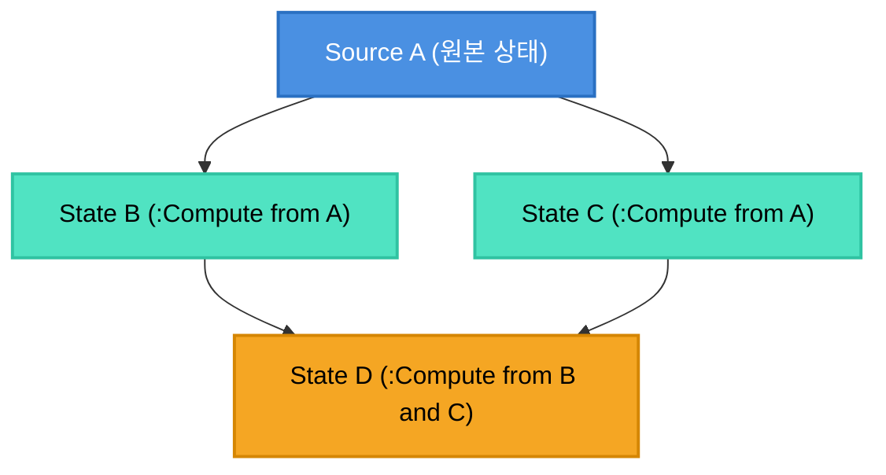

# [Reactivity Deep Dive] 다이아몬드 의존성과 반응형 엔진: TC39 Signals / Preact / SolidJS vs Quad의 32-bit Revision & EpochMap

> **대상 독자**: SolidJS, Preact Signals, Vue 3, TC39 Signals 제안 등 웹의 정밀 반응형(Fine-grained Reactivity) 시스템에 익숙하며, Quad의 상태 그래프(`Source`, `State`, `Compute`, `EpochMap`) 설계 원리를 깊이 이해하고자 하는 엔지니어.  
> **목적**: 반응형 UI의 최대 난제인 '다이아몬드 의존성(Diamond Dependency)'을 웹과 Quad가 각각 어떤 수학적·알고리즘적 접근으로 풀어냈는지 비교하고, 암묵적 추적(Implicit Tracking)을 의도적으로 배제한 Quad의 설계 철학을 팩트체크합니다.

---

## 1. 반응형 UI의 영원한 난제: 다이아몬드 의존성 (Diamond Dependency)

정밀 반응형(Fine-grained Reactivity) 프레임워크를 설계할 때 모든 아키텍트가 반드시 마주치는 악명 높은 구조가 **다이아몬드 의존성 그래프**입니다.



`Source A`의 값이 바뀔 때, 나이브한 순수 푸시(Push) 방식으로 이벤트를 전파하면 두 가지 치명적인 결함이 발생합니다:

1. **중복 연산(Duplicate Evaluation / Glitch Wave)**:  
   `D`는 `B`의 변경으로 인해 한 번 계산되고, 뒤이어 `C`의 변경으로 인해 또 한 번 불필요하게 계산됩니다.
2. **일시적 불일치 상태 (Torn State / Glitch)**:  
   `B`는 새 값으로 갱신되었으나 `C`는 아직 이전 값인 상태에서 `D`가 중간 실행됩니다. 만약 `D`가 `B / C`를 계산하는 로직이라면, 일시적으로 `C`가 0이 되어 런타임 크래시가 나거나 화면이 번쩍(Flicker)거립니다.

---

## 2. 웹 진영의 해법: Push-Pull 2단계 알고리즘 (Preact Signals / TC39 Signals)

웹의 신세대 반응형 시스템(Preact Signals, Angular Signals, 그리고 공식 자바스크립트 표준으로 논의 중인 **TC39 Signals Proposal**)은 다이아몬드 글리치를 해결하기 위해 **Push-Pull 2단계 파이프라인**을 정립했습니다.

### (1) 1단계: Eager Push-Invalidate (더티 마킹 단계)
* `A`의 값이 바뀌면, 값을 즉시 재계산하지 않습니다.
* 의존성 그래프를 아래로 가볍게 순회하면서 연결된 노드들에게 **"너는 이제 낡은 값(Dirty)이다"**라는 플래그만 세웁니다.
* 이 단계에서는 **어떠한 사용자 연산 함수도 실행되지 않습니다.**

### (2) 2단계: Lazy Pull-Recompute (지연 평가 단계)
* 실제 화면에 값을 그리거나 이펙트가 값을 읽는 시점(`node.value`)에 재계산이 트리거됩니다.
* 자신의 상류 노드들이 Dirty 상태인지 확인하고, 위상 정렬 순서대로 상류 노드를 먼저 1회만 계산한 뒤 자신의 값을 계산합니다.
* 결과적으로 `D`는 `B`와 `C`가 모두 최신화된 후 **정확히 단 1회만 계산**됩니다.

---

## 3. Quad의 해법: 32-bit Wrapping Revision과 `EpochMap`

Quad 역시 웹의 최신 Signals와 동일한 **Push-Pull 하이브리드 철학**을 공유합니다. 그러나 Luau 런타임의 극단적인 성능 최적화를 위해 **"위상 정렬 큐" 대신 "리비전 카운터와 해시맵"을 결합한 독창적인 알고리즘**을 개발했습니다.

### (1) FASTCALL을 극한으로 쥐어짠 `bit32.bnot(-rev)`
[`quad-base/src/Source.luau`](file:///code/Projects/quad/quad-base/src/Source.luau)와 `Ref`에서 소스가 변경될 때 리비전을 올리는 코드는 다음과 같습니다:
```luau
self.Revision = bit32.bnot(-self.Revision)
```

* **왜 `rev += 1`을 쓰지 않는가?**  
  Luau의 숫자는 기본적으로 IEEE-754 double(배정밀도 부동소수점)입니다. `+1` 연산은 부동소수점 덧셈을 수행하며, 2^53에서 정밀도 손실로 포화됩니다.  
  반면 `bit32.bnot`은 Luau VM이 **FASTCALL(단일 C/어셈블리 인스트럭션)**로 최적화하는 빌트인입니다. 분기문이나 마스킹 없이 32비트 정수 오버플로를 완벽하게 래핑(Wrap-around)합니다.
* **계약은 "직전과 다르다(`~=`) 하나뿐"**:  
  리비전 숫자의 대소 관계(`<`)는 전혀 중요하지 않습니다. 오직 "이전 리비전과 같은가, 다른가"만을 판정 기준으로 삼습니다.

### (2) Push Phase: `_receive`와 `EpochMap`의 3대 전파 규칙
소스가 변경되면 하류 노드로 신호가 전파되지만, **사용자 함수는 0.001초도 실행되지 않습니다.** 오직 [`quad-base/src/State.luau`](file:///code/Projects/quad/quad-base/src/State.luau)의 `_receive`만이 동작합니다:

```luau
function Impl._receive(self: any, from: any)
    local valueChanged = self._valueEpochMap:Update(from)
    local emitChanged = self._emitEpochMap:Update(from)
    if valueChanged then
        self:_invalidate() -- 캐시 무효화 (TargetCount 변경)
    end
    if valueChanged or emitChanged then
        emitDown(self, from) -- 출처(from)를 그대로 하류로 토스
    end
end
```

여기서 다이아몬드가 접히는 마법이 일어납니다:
1. **Rule 1 (값 무효화)**: 상류 소스 `from`의 리비전이 변경되었으면 `_invalidate()`가 정수 카운터를 뒤집어 캐시를 더티 상태로 만듭니다.
2. **Rule 2 (동일 출처 전파)**: 내가 계산한 값을 보내는 게 아니라, 나를 깨운 **최초의 출처 `from` 객체 자체**를 하류에 그대로 전달합니다.
3. **Rule 3 (다이아몬드 파동 삼키기 - Swallow)**:
   * `D`는 `B`를 통해 첫 번째 전파를 받고, `C`를 통해 두 번째 전파를 받습니다.
   * 첫 번째 전파(`B -> D`): `D._valueEpochMap:Update(from)`이 `true`를 반환하고 캐시를 무효화합니다.
   * 두 번째 전파(`C -> D`): `D._valueEpochMap`은 이미 방금 전 `from`의 최신 리비전을 기록해 두었습니다. 따라서 `Update(from)`은 **`false`**를 반환합니다.
   * **`valueChanged`가 거짓이므로 두 번째 파동은 그 자리에서 완전히 소멸(Swallowed)합니다!**

### (3) Pull Phase: 완벽한 지연 평가 (`Get()`)
실제 유저의 연산 함수는 `:Get()`이 불릴 때 루프를 돌며 단 한 번 실행됩니다:
```luau
function Impl.Get(self: any): any
    while true do
        if self._cacheCurrCount ~= self._cacheTargetCount then
            self:_recompute()
        elseif self._valueEpochMap:Refresh() then
            self:_invalidate()
            self:_recompute()
        else
            return self._cache
        end
    end
end
```
* `_cacheCurrCount ~= _cacheTargetCount`: 상류에서 무효화 신호가 왔는지 정수 비교 1회로 즉시 확인합니다.
* 다이아몬드 하류의 `D`가 `:Get()`을 부르면, `B`와 `C`의 최신 리비전을 확인하여 단 1회만 재계산하고 결과를 캐싱합니다.

---

## 4. 웹 Signals vs Quad의 결정적 분기점: 암묵적 추적(Ambient Stack)을 거부한 이유

웹 개발자가 Quad를 사용할 때 가장 크게 체감하는 문법적 차이는 다음과 같습니다.

* **웹 (SolidJS / Preact / Vue / TC39 Signals)**:
  ```javascript
  // 의존성을 적지 않는다. 그냥 읽으면 알아서 잡힌다!
  const fullName = createMemo(() => `${firstName()} ${lastName()}`);
  ```
* **Quad**:
  ```luau
  -- 의존성을 반드시 인자로 명시해야 한다!
  local fullName = firstName:Depend(lastName):Compute(function(f, prev, l)
      return `{f:Get()} {l:Get()}`
  end)
  ```

왜 Quad는 웹의 최신 프레임워크들이 당연하게 제공하는 **"암묵적 의존성 추적(Ambient/Implicit Tracking)"**을 거부하고 수동 명시 방식을 채택했을까요?

### (1) Luau의 코루틴(Yield)과 런타임 오염 방지
웹의 JavaScript는 단일 스레드 이벤트 루프 기반이며, `await` 전까지는 코드가 동기적으로 끝까지 실행됩니다.
반면 Roblox/Luau 환경은 태스크 스케줄러와 코루틴(`task.wait()`, `coroutine.yield()`)이 매우 빈번하게 사용됩니다.

* 함수 내부에서 yield가 일어나는 순간, 전역 실행 스택(Global Tracking Context)의 "지금 어떤 컴포넌트/시그널을 계산 중인가" 포인터가 오염되거나 멈춰버립니다.
* 실제로 Roblox의 타 라이브러리(Vide 등)는 암묵적 추적을 유지하기 위해 리액티브 스코프 내부의 yield를 강제로 차단하는 방어 장치를 겹겹이 둘러야 했습니다.
* Quad는 이 복잡성을 근본적으로 제거하기 위해 **전역 스코프 스택 자체를 없애는 길**을 선택했습니다.

### (2) 정적 가독성: "이 파이프는 언제 다시 도는가?"
웹 프레임워크에서는 컴포넌트가 커질수록 "이 `computed`가 도대체 어떤 상태들에 반응하여 다시 실행되는지"를 코드만 보고 파악하기 어렵습니다. 콜백 내부의 복잡한 조건문(`if (cond) a() else b()`) 속에서 의존성이 런타임에 동적으로 바뀌기 때문입니다.

Quad는 `:Compute(fn, ...deps)` 또는 `:Depend(...)`를 통해 **의존성을 호출부에 정적으로 박아두도록 강제**합니다.
* 파이프가 언제 다시 도는지를 호출부 한 줄만 보고 100% 정적으로 파악할 수 있습니다.
* 의존성 목록이 런타임에 불변이므로, 내부 반응형 그래프 엣지(Edge)를 동적으로 교체하는 오버헤드가 없습니다.

---

## 5. 요약 비교 매트릭스

| 비교 축 | SolidJS | Preact Signals / TC39 Signals | Quad |
| :--- | :--- | :--- | :--- |
| **전파 알고리즘** | Push-Pull (Execution Clock 기반) | Push-Pull (Eager-Dirty + Lazy-Pull) | **Push-Pull (`EpochMap` + Revision)** |
| **재계산 시점** | `createMemo`는 기본 Eager 실행 | Observer나 화면이 읽을 때 Lazy Pull | **모든 State는 오직 `:Get()` 시점 Lazy Pull** |
| **다이아몬드 처리** | 실행 클럭 순서로 동기 정렬 | Dirty 플래그 전파 후 위상 순서 재계산 | **`EpochMap`이 두 번째 파동을 즉시 삼킴(Swallow)** |
| **리비전 식별** | 내부 Clock 카운터 | 글로벌 Version 숫자 | **`bit32.bnot(-rev)` 32-bit FASTCALL 래핑** |
| **의존성 선언** | **암묵적 자동 추적** (전역 스택) | **암묵적 자동 추적** (전역 스택) | **명시적 정적 선언** (`:Depend`, `:Compute`) |
| **Yield/비동기 내성** | 런타임 비동기 시 스코프 유실 주의 | 동기 턴에서만 추적 | **전역 스택이 없으므로 비동기 간섭 원천 차단** |

---

## 6. 결론

웹의 Signals 진영이 "개발자가 의존성을 신경 쓰지 않아도 되는 암묵적 마법"을 향해 발전해 왔다면, Quad는 **"마법 없는 결정론적 정적 선언"과 "Luau FASTCALL을 극한까지 쥐어짠 수학적 알고리즘"**을 선택했습니다.

두 진영은 다이아몬드 의존성을 해결하는 핵심 통찰(Push Invalidate + Pull Recompute)을 공유하지만, 플랫폼 환경의 특성(JS 단일 스레드 vs Luau 코루틴)에 따라 완전히 다른 최적화 지점에 도달한 훌륭한 엔지니어링 사례입니다.
