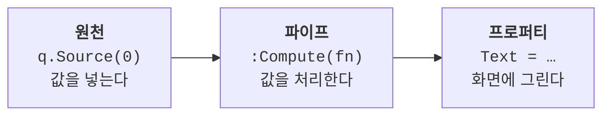
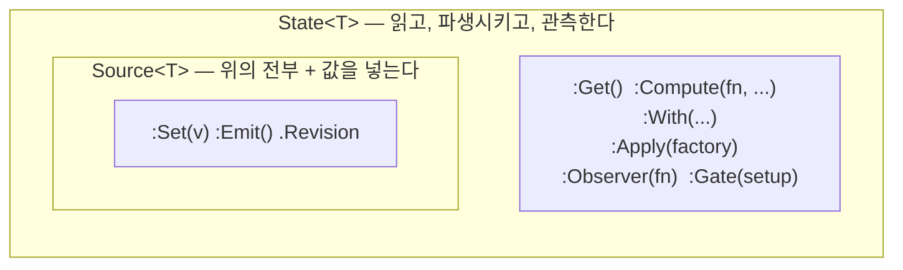

# [시작하기] 03. 값이 흐르게 하기 — 원천에서 프로퍼티까지

> **대상 독자**: [02. 첫 화면](./02-first-screen.md)을 끝낸 개발자
> **목표**: 값 하나를 바꿨을 때 화면이 저절로 따라오게 만들고, 그 길에 파이프를 하나 끼워 보기

02장의 라벨은 `Text = "카운트: 0"`으로 **한 번 찍고 끝난** 글씨입니다. 이 장에서는 그 자리를 **흐르는 값**으로 바꿉니다.

---

## 지금까지의 코드

```luau
-- (Main.client.luau 계속 — 카드를 화면 가운데 놓는 AnchorPoint/Position은
--  이 장부터 생략합니다. 02장 그대로 두면 됩니다)
const card = D.Frame {
    Size = UDim2.fromOffset(240, 160),
    BackgroundColor3 = Color3.fromRGB(35, 35, 42),
    UICorner = 12,

    D.TextLabel {
        Position = UDim2.fromOffset(16, 0),
        Size = UDim2.new(1, -32, 0, 48),
        BackgroundTransparency = 1,
        TextColor3 = Color3.fromRGB(255, 255, 255),
        TextScaled = true,
        Text = "카운트: 0",
    },
}
```

---

## 1. 값의 원천 만들기

먼저 값을 **담아 둘 자리**를 하나 만듭니다. `q.Source(...)`가 그 자리입니다.

`card` 위에 한 줄을 두고, 라벨의 `Text` 한 줄을 그 자리로 바꿉니다.

```luau
-- … 위쪽 코드에 이어집니다
const label = q.Source("카운트: 0")   -- ① 값의 원천

const card = D.Frame {
    -- …생략…
    D.TextLabel {
        -- …생략…
        Text = label,                  -- ② 리터럴 대신 원천을 그대로 꽂는다
    },
}

label:Set("카운트: 1")                 -- ③ 원천의 값을 바꾼다
```

**실행하면** 화면에는 `카운트: 1`이 보입니다. 라벨을 다시 만들지도, `label.Text = ...`를 다시 대입하지도 않았는데 화면이 바뀌었습니다.

프로퍼티 자리에 **값 대신 원천을 꽂으면**, 그 프로퍼티는 그때부터 원천을 따라갑니다. `:Set`을 부를 때마다 quad가 그 자리에 새 값을 씁니다.

---

## 2. 중간에 파이프 끼우기

그런데 우리가 세는 것은 **숫자**입니다. 원천은 숫자로 두고, 화면에 보일 글자는 그 숫자를 **처리해서** 얻는 쪽이 낫습니다. 원천과 프로퍼티 사이에 값을 처리하는 **파이프 조각**을 하나 끼웁니다.

```luau
-- … 위쪽 코드에 이어집니다(방금 만든 label을 count/countText로 갈아 끼웁니다)
const count = q.Source(0)                      -- ① 원천은 숫자

const countText = count:Compute(function(c)    -- ② 파이프: 숫자를 글자로 처리한다
    return `카운트: {c:Get()}`
end)

const card = D.Frame {
    -- …생략…
    D.TextLabel {
        -- …생략…
        Text = countText,                       -- ③ 파이프의 끝을 프로퍼티에 꽂는다
    },
}

count:Set(7)
```

**실행하면** 화면에 `카운트: 7`이 보입니다. `count`가 움직이면 파이프가 다시 계산되고, 그 결과가 프로퍼티까지 흘러갑니다.



파이프의 콜백에서 눈여겨볼 것이 하나 있습니다. **콜백이 받는 `c`는 값이 아니라 핸들입니다** — 그래서 `c:Get()`으로 읽습니다.

파이프가 도는 **시점**도 짚어 둘 만합니다. `count:Set(7)`은 값을 파이프 안으로 밀어 넣지 않습니다 — **"바뀌었다"를 알릴 뿐이고**, 숫자를 글자로 바꾸는 일은 라벨이 그 값을 읽을 때 일어납니다. 이 성질이 라이브러리 곳곳에서 어떤 모습으로 나타나는지는 [16장](./16-laziness.md)에서 한 번에 봅니다.

---

## 3. 원천이 둘 이상일 때

파이프는 다른 값도 같이 볼 수 있습니다. **다만 콜백 안에서 읽는 것만으로는 의존성이 잡히지 않습니다** — 볼 대상을 `:Compute`의 뒤 인자로 **명시**해야 합니다.

```luau
-- … 위쪽 코드에 이어집니다
const suffix = q.Source("회")

const both = count:Compute(function(c, previous, s)
    return `{c:Get()}{s:Get()}`
end, suffix)                      -- ← suffix를 명시해야 suffix가 움직일 때도 다시 흐른다

print(both:Get())  --> "7회"
suffix:Set("번")
print(both:Get())  --> "7번"
```

**실행하면** `suffix`만 바꿨는데도 `both`가 새 값을 내놓습니다. `:Compute` 뒤에 적어 둔 것이 그 파이프가 지켜볼 목록이기 때문입니다.

콜백의 자리는 `(self, previous, ...deps)`입니다 — 첫 자리는 `:Compute`를 부른 그 노드, 둘째 자리는 이 파이프가 직전에 내놓은 결과값, 셋째부터가 뒤에 적은 의존성들입니다. 핸들로 오는 것은 첫 자리와 의존성들이고, `previous`만은 값 그 자체라 **첫 계산에서는 `nil`입니다**. 값은 그대로 두고 **구독 범위만 넓히고** 싶으면 `count:With(suffix)`도 있습니다.

---

## 4. 그래서 이름이 둘입니다

여기까지 만든 것에 이름을 붙입니다.

- **`Source`** — 값을 **넣을 수 있는** 원천. `q.Source(v)`로 만들고 `:Set(v)`으로 씁니다.
- **`State`** — 읽기만 되는 파이프의 끝. `:Compute`/`:With`가 만들어 준 노드가 이것입니다. **공개 생성자가 없습니다** — `q.State(...)` 같은 것은 없습니다.

둘의 관계를 정하는 규칙은 하나뿐입니다. **모든 `Source`는 그대로 `State`입니다.** `State`를 요구하는 자리(프로퍼티 자리, `:Compute`의 의존성 자리)에 `Source`를 그냥 넘기면 됩니다 — 언래핑도, 변환도 없습니다. 위 1절에서 `Text = label`이 그대로 통했던 게 그래서입니다.

<details>
<summary><strong><code>Source</code>와 <code>State</code>는 정확히 어떤 관계인가요?</strong></summary>



안쪽 상자가 바깥 상자에 그대로 들어 있다는 것이 위 규칙의 그림입니다 — `Source`는 `State`의 메소드를 전부 가진 채 `:Set`만 더 갖습니다. 아직 안 나온 `:Apply`는 [11장](./11-functions.md)에서 처음 쓰고 [14장](./14-animation.md)에서 애니메이션에 얹으며, `:Gate`는 [15장](./15-blocker.md)의 `Blocker`가 얹히는 자리입니다.

</details>

> `--!strict`로 쓸 때 파생 노드와 콜백 파라미터에 붙여야 하는 타입 주석은 [01. 컴포넌트 경계 규약과 스타일 합성](../how-to/01-component-conventions.md) §6에 있습니다.

---

## 더 알고 싶다면

- [레퍼런스: `Source`](../reference/core/02-source.md) — `:Set`이 같은 값에도 늘 전파하는 이유, 제자리 변경을 알리는 `:Emit`
- [레퍼런스: `State`](../reference/core/03-state.md) — `:Get`의 lazy 계산, `:Compute`의 인자 검증, `:Apply`와 `:Gate`
