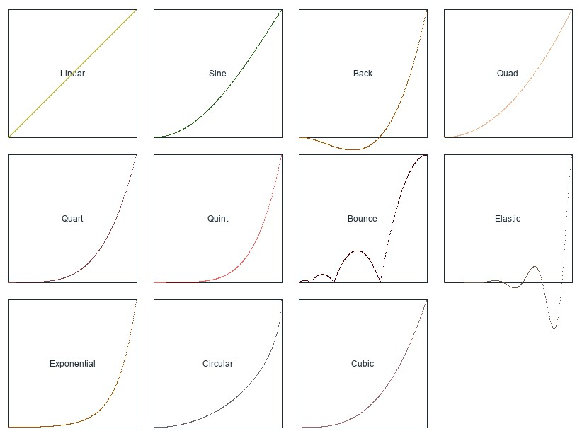

  
[모든 Easing 은 여기에서 직접적으로 확인할 수 있습니다.](https://easings.net/)  

`Linear`  
> 아무런 가감속이 없는 1차형 함수입니다  

---

`Quint`  
> 5 제곱을 이용한 가감속 함수입니다. Quart 보다 가파른 개형을 가졌습니다  

---

`Quart`  
> 네제곱을 이용한 가감속 함수입니다. Cubic 보다 가파른 개형을 가졌습니다  

---

`Cubic`  
> 세제곱을 이용한 가감속 함수입니다. Quad 보다 가파른 개형을 가졌습니다  

---

`Quad`  
> 제곱을 이용한 가감속 함수입니다.  

---

`Expo`  
> 지수형 가감속 함수입니다. 매우 가파른 개형을 가졌습니다.  

---

`Sin`  
> 사인 파형을 사용한 함수입니다.  

---

`Circle`  
> 원형 가감속 함수입니다.  

---

`Back`  
> 시작시 뒤로 이동이 있는 가감속 함수입니다.  

---

`Elastic`  
> 탄성을 가지는 가감속 함수입니다.  

---

`Bounce`  
> 튀김을 가지는 가감속 함수입니다.  

TODO: 애니메이션 미리보기 영상 추가
