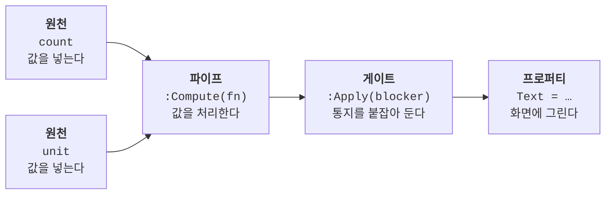

> **대상 독자**: [15. 움직이게 하기](/getting-started/15-animation/)를 끝낸 개발자
> **목표**: 값 여럿을 한 번에 바꿀 때 중간 상태가 화면에 새지 않게 막기

지금까지는 값을 하나씩 바꿨습니다. **둘을 같이 바꿔야 할 때** 무슨 일이 생기는지부터 봅니다.

미리 밝혀 두면, 이 장의 `q.Blocker`는 코어 메커니즘이 아니라 `state:Gate` 위에 얹힌 **순수 슈거**입니다 — 같은 것을 라이브러리 밖에서 그대로 짤 수 있고, 그래서 레퍼런스에서도 sugar 그룹에 있습니다. 붙이는 자리도 새 문법이 아닙니다 — [12장](/getting-started/12-functions/)에서 `:Apply`에 넘긴 것은 함수였고, `Blocker`는 같은 자리에 `__apply`를 가진 **객체**로 들어갑니다.

---

## 1. 값 둘을 같이 바꾸면 화면이 두 번 바뀝니다

카운터에 단위를 붙입니다. 03장에서 `suffix`를 의존으로 넘겼던 그 모양 그대로입니다.

이 장의 예제는 `Blocker` 하나를 보기 위해 **props 없이 값을 직접 박은 단독 카운터**로 되돌립니다 — 11장의 `props.Start`/`props.Label`도, 14장의 `props.Ctx`도 여기서는 쓰지 않습니다.

```luau
-- … (Counter.luau) 상태 두 개와 파이프 하나
    const count = q.Source(10)
    const unit = q.Source("점")

    const countText = count:Compute(function(c, prev, u)
        return `{c:Get()} {u:Get()}`
    end, unit)
```

단위를 바꾸는 버튼을 답니다. 10점은 100포인트라 **값과 단위를 같이** 바꿔야 합니다.

```luau
-- … (Counter.luau) 카드의 숫자 키 자리에 이어집니다
        D.TextButton {
            Text = "단위 바꾸기",
            Activated = function()
                const toPoint = unit:Get() == "점"
                count:Set(if toPoint then count:Get() * 10 else count:Get() // 10)
                unit:Set(if toPoint then "포인트" else "점")
            end,
        },
```

**실행하면** 버튼 한 번에 라벨이 `10 점` → `100 포인트`로 갑니다. 그런데 `:Set` 사이를 끊어 보면 이렇습니다.

```
마운트 직후        Text = "10 점"
count:Set(100) 뒤  Text = "100 점"     ← 어느 시점에도 진실이 아닌 중간 상태
unit:Set 뒤        Text = "100 포인트"
```

두 `:Set`이 각각 통지를 냈기 때문입니다. 파이프 함수가 돈 횟수도 마운트 1회 + 버튼 2회 = **3회**입니다.

---

## 2. 통지를 붙잡아 뒀다가 한 번에 — `q.Blocker()`

`Blocker`는 **전파를 잠시 붙잡아 두는 스위치**입니다. 파이프 끝에 게이트를 하나 끼워 두고 그 스위치로 여닫습니다.

```luau
-- … (Counter.luau) 위 §1의 파이프 끝에 한 토막을 덧붙입니다
    const blocker = q.Blocker()

    const countText = count:Compute(function(c, prev, u)
        return `{c:Get()} {u:Get()}`
    end, unit):Apply(blocker)      -- ← 파이프 끝에 게이트 하나
```

§1에서 바뀐 것은 **마지막 `:Apply(blocker)` 한 토막**뿐입니다 — 원천 둘도, 파이프의 콜백도 그대로입니다.

**그 한 토막이 돌려주는 것이 새 노드라는 게 핵심입니다.** 라벨이 보는 `countText`는 게이트를 지난 쪽이어야 합니다 — `Blocker`를 만들어 두기만 하거나, `:Apply`를 부르고 그 반환을 받지 않은 채 게이트 없는 예전 노드를 계속 꽂아 두면 아무것도 막히지 않습니다.

03장의 그림에 게이트 한 단이 끼어든 모양입니다 — 원천 둘이 파이프에서 하나로 합쳐진 **뒤에** 게이트가 섭니다.



**게이트를 파이프 뒤에 두는 이유**는 게이트가 모으는 것이 값이 아니라 **통지**이기 때문입니다. 붙잡아 둔 통지는 푸는 순간 전부 하류로 나갑니다. 그러니 통지가 아직 여러 갈래로 갈라져 있는 자리에 게이트를 여러 개 세우면, 푸는 순간 그 갈래 수만큼 통지가 나갑니다 — 원천 둘에 하나씩 두면 `:Off()` 한 번에 통지가 둘이고 라벨의 `Text` 쓰기도 두 번입니다. 통지까지 한 번으로 접으려면 두 원천이 **합쳐진 뒤** 한 자리에서 막아야 합니다. **1차선 톨게이트**를 세우는 자리라고 보면 됩니다 — 길이 합쳐진 다음에 세워야 차가 한 줄로 지나갑니다.

<details>
<summary><strong>원천마다 게이트를 두면 안 되나요?</strong></summary>

됩니다. **중간 상태는 그쪽으로도 막힙니다** — `count:Apply(blocker):Compute(fn, unit:Apply(blocker))`로 짜도 `100 점`은 화면에 나타나지 않습니다. 첫 통지를 받고 라벨이 값을 당겨 올 때 `count`와 `unit`이 이미 둘 다 최신이기 때문입니다.

갈리는 것은 그다음입니다. `:Off()` 한 번에 **통지가 둘** 나가고 라벨의 `Text` 쓰기도 **두 번**입니다(파이프 뒤에 하나면 각각 한 번). 반면 파이프 함수가 돈 횟수는 두 모양이 똑같이 한 번인데, 그건 게이트 덕이 아니라 [17장](/getting-started/17-laziness/)의 게으름 덕입니다 — 둘째 통지가 왔을 때는 새로 계산할 것이 남아 있지 않습니다.

하나의 `Blocker`를 여러 노드에 붙이는 것 자체는 유효한 쓰임입니다(§4).

</details>
<!-- mock 실측 2026-09-11: gs.blocker2.luau — 파이프 뒤 게이트 하나: Off 뒤 파이프 계산 +1·통지 +1·Text 쓰기 +1 / 원천마다 게이트: 계산 +1·통지 +2·쓰기 +2, 둘 다 On 구간 화면은 `10 점` 그대로 -->

<details>
<summary><strong><code>Blocker</code> 아래에는 뭐가 있나요?</strong></summary>

`state:Gate(setup)`입니다. 게이트는 상류에서 온 통지를 자기 안에 모아 두고, 언제 한 번에 내려보낼지를 `setup`이 돌려준 정책 함수에 맡기는 노드입니다.

`Blocker`는 그 위에 얹힌 **정책 하나**입니다 — "켜져 있으면 모으고, 끄면 흘려보낸다". `state:Apply(blocker)`는 `state:Gate(function(emit) return blocker:Policy(emit) end)`와 정확히 같고, 게이트를 직접 배선하면 다른 정책도 만들 수 있습니다([레퍼런스: `state:Gate(setup)`](/reference/core/03-state/#stategatesetup)).

</details>

버튼은 바꾸는 구간을 `:On()`과 `:Off()`로 감쌉니다.

```luau
-- … (Counter.luau) 단위 바꾸기 버튼의 Activated
            Activated = function()
                blocker:On()
                -- …§1의 본문 세 줄 그대로…
                blocker:Off() -- 여기서 한 번만 통지된다
            end,
```

**실행하면** 라벨은 `10 점`에서 `100 포인트`로 곧바로 넘어가고 `100 점`은 나타나지 않습니다. 파이프 함수가 돈 횟수는 마운트 1회 + 버튼 1회 = **2회**이고(§1은 3회였습니다), `:Off()`가 낸 통지는 **1회**입니다.

---

## 3. 화면만 멈추는 "일시정지" 버튼

같은 스위치를 켜 둔 채로 둘 수도 있습니다. 단위는 잠시 잊고 `count` 하나만 보는 라벨로 **되돌려** 두겠습니다 — 게이트를 파이프 뒤에 두는 것은 그대로입니다.

```luau
-- … (Counter.luau) §1·§2의 상태 둘과 파이프를 이 한 벌로 갈아 끼웁니다
    const count = q.Source(0)

    const shownText = count:Compute(function(c)
        return `카운트: {c:Get()}`
    end):Apply(blocker)          -- 게이트는 여전히 파이프 뒤

    -- 라벨은 shownText를 봅니다:  D.TextLabel { Text = shownText }
```

버튼이 스위치를 토글하게 합니다.

```luau
-- … (Counter.luau) 카드의 숫자 키 자리에 버튼 하나 더
        D.TextButton {
            Text = "일시정지",
            Activated = function()
                if blocker:IsOn() then blocker:Off() else blocker:On() end
            end,
        },
```

**실행하면** 일시정지를 누른 뒤로는 `+ 1`을 아무리 눌러도 라벨이 `카운트: 0`에서 멈춰 있습니다. 다시 누르면 밀린 것이 **한 번에** 최신값으로 반영됩니다 — 세 번 눌렀다면 `카운트: 1`, `2`를 거치지 않고 곧장 `카운트: 3`입니다.

**막는 것은 통지지 값이 아닙니다.** 멈춰 있는 동안에도 값은 최신입니다.

```luau
-- (일시정지를 켜 두고 + 1을 세 번 누른 뒤)
print(label.Text)        --> "카운트: 0"   (화면은 멈춰 있고)
print(shownText:Get())   --> "카운트: 3"   (값은 이미 최신이다)
```
<!-- mock 실측 2026-09-11: gs.blocker2.luau — 파이프 뒤 게이트 + 일시정지: On 뒤 Set 1,2,3 → 라벨 `카운트: 0` / shownText:Get() = `카운트: 3` / Off 뒤 라벨 `카운트: 3` -->

<details>
<summary><strong>시간으로 막고 싶으면요?</strong></summary>

"신호가 멎고 0.2초 뒤에 한 번만 통과" 같은 시간 정책은 손으로 여닫는 대신 `q.Debounce` / `q.Throttle`을 쓰면 됩니다. 같은 게이트 위에 얹힌 시간 버전이라 붙이는 방법도 `state:Apply(...)`로 같고, 옵션과 제어 핸들은 [레퍼런스: `Debounce` / `Throttle`](/reference/sugar/03-debounce-throttle/)에 있습니다.

</details>

---

## 4. 알아 둘 것 셋

- **`:OffWithoutEmit()`은 쌓인 것을 버리고 풉니다** — 통지 없이 조용히 끝내고 싶을 때. 버려도 그래프는 망가지지 않습니다(값은 어차피 읽는 시점에 최신입니다).
- **하나의 `Blocker`를 여러 노드에 붙일 수 있습니다.** `:Off()` **한 번**이 붙어 있는 게이트 전부를 풉니다 — 다만 통지는 **게이트마다 하나씩** 나갑니다. 그래서 한 화면을 한 번에 갱신하려는 목적이라면 게이트는 통지가 합쳐지는 자리에 하나만 두고(§2), 서로 다른 화면 여러 곳을 같은 스위치로 묶고 싶을 때 여러 노드에 붙입니다.
- **`IsBlocked`는 카운터가 아니라 평범한 불리언입니다.** `:On()`을 두 번 해도 `:Off()` 한 번이면 풀리니, 겹치는 구간이 필요하면 구간마다 `Blocker`를 따로 만드세요.

---

## 더 알고 싶다면

- [레퍼런스: `Blocker`](/reference/sugar/06-blocker/) — `On`/`Off`/`OffWithoutEmit`/`Policy`, 푸는 도중 다시 잠갔을 때의 동작
- [레퍼런스: `state:Gate(setup)`](/reference/core/03-state/#stategatesetup) — 게이트 계약과 직접 배선
- [레퍼런스: `Debounce` / `Throttle`](/reference/sugar/03-debounce-throttle/) — 같은 게이트 위의 시간 정책
- [03. 긴 목록을 가볍게 그리기](/how-to/03-virtualized-infinite-scroll/) — 스크롤 이벤트 폭주를 `Blocker`로 접는 실전 예
