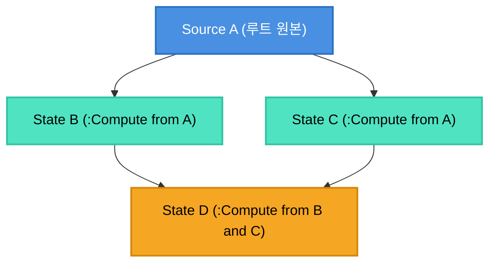

# [Quadnomicon Vol. 1] 32-bit Wrapping Revision과 EpochMap: 다이아몬드 글리치를 접는 법

> **작성 목적**: 프레임워크 아키텍트 및 고급 엔지니어를 위한 기술 해설서
> **관련 소스**: `quad-base/src/State.luau`, `quad-base/src/EpochMap.luau`, `quad-base/src/Source.luau`

> [!CAUTION]
> 이 권은 반응형 무효화 엔진의 리비전·에폭 내부를 다룹니다. 애플리케이션을 만들려고 quad를 배우는 중이라면 [Getting Started](/quad/ko/getting-started/01-core-mental-model/)부터 보십시오.

---

## 1. 반응형 UI의 영원한 숙제: 다이아몬드 의존성 문제 (The Diamond Problem)

정밀 반응형(Fine-grained Reactivity) 시스템을 구축할 때 모든 라이브러리가 반드시 마주치는 구조가 있습니다. 바로 **다이아몬드 의존성(Diamond Dependency)**입니다:



`Source A`가 새로운 값으로 변경될 때, 시스템이 순진한 푸시(Eager Push) 모델을 채택하면 두 가지 결함이 발생합니다:

1. **중복 연산(Duplicate Execution)**: `D`가 `B`의 변경으로 한 번, 곧이어 `C`의 변경으로 또 한 번 계산됩니다.
2. **글리치(Glitch / 일시적 불일치 상태)**: `B`는 갱신되었으나 `C`는 아직 갱신되지 않은 **중간 상태**에서 `D`가 실행되어, 일시적으로 잘못된 UI를 그리거나 0으로 나누기 같은 런타임 에러를 유발합니다.

---

## 2. 기존 프레임워크들의 접근법

### Vide: 순수 push, 즉시 동기 재평가

Vide는 SolidJS 계열의 **순수 push** 모델입니다. `source()`를 쓰면 즉시, 동기적으로, 깊이우선으로 모든 의존 노드를 재평가합니다 — lazy/pull 경로가 아예 없습니다. 그 결과 다이아몬드에서 `D`가 두 번 재평가되고, **저자들 스스로 `todo.md`에 "복잡한 다이아몬드 그래프에서 중복 재평가 방지"를 미해결 항목으로 남겨두었습니다.** 의존성 추적은 함수 실행 중 전역 스택을 통해 읽히는 소스를 암묵적으로 잡는(ambient) 방식입니다.

### Fusion: push-invalidate + eager 집합의 생성순 정렬

Fusion은 push(무효화) + pull(재계산) 하이브리드입니다. `Value:set()`이 `dependentSet`을 BFS로 훑으며 `invalid`로 마킹하지만, 실제 재계산은 `timeliness = "eager"`인 노드(Observer/Tween/Spring)만 즉시 동기 실행하고 `Computed`/`Value`는 `use()`될 때 lazy하게 재계산합니다. 글리치는 **eager 집합을 `createdAt` 순으로 정렬해서** 막습니다.

정리 모델 쪽 비용은 다른 축입니다 — 모든 상태 노드의 수명을 관리하기 위해 `Scope` 테이블을 컴포넌트 함수 인자로 계속 넘겨야 하는 배관(plumbing)이 필요합니다.

---

## 3. Quad의 해법: 32-bit Wrapping Revision + EpochMap

Quad는 위상 정렬도 생성순 정렬도 쓰지 않습니다. 대신 **리비전 카운터와 해시맵**을 결합한 2단계 파이프라인(Push-Invalidate, Pull-Recompute)으로 다이아몬드를 접습니다.

### 3.1. 리비전 갱신은 `bit32.bnot(-rev)` 한 번이다

`Source:Set`/`:Emit`(`quad-base/src/Source.luau`)과 `Ref:Set`(`quad-base/src/Ref/init.luau`)이 리비전을 갱신하는 코드는 이렇습니다:

```luau
self.Revision = bit32.bnot(-self.Revision)
```

**이건 랩어라운드 *감소*입니다** — `a > 0`이면 `a - 1`, `a == 0`이면 `4294967295`로 한 바퀴 돕니다. 이름이 `Revision`이지만 순서를 뜻하지 않습니다. 계약은 **"직전과 다르다"** 하나뿐이고, 아래 전파 규칙 어디에도 `<` 비교는 없이 `==`/`~=`만 쓰입니다. (나중에 순서 비교를 넣고 싶어지면 이 결정부터 되짚어야 합니다.)

#### 왜 `rev += 1`이 아닌가 — 이유는 성능이다

- 평이한 `+1`이었다면 Luau 숫자가 double이라 `2^53`에서 **포화**합니다: `n + 1 == n`이 되어 "다르다"는 보장이 정확히 그 지점에서 깨집니다. 다만 그 지점은 초당 100만 `Set`으로 285년이라 **도달 불가능**합니다.
- 그러니 `bit32`를 고른 이유는 안전이 아니라 **비용**입니다. `bit32.bnot`은 Luau가 FASTCALL로 거는 빌트인이라 별도의 덧셈도 마스킹도 없고, 단항 부호 반전 하나가 붙을 뿐입니다. 이건 매 `Set`마다 도는 hot path이므로, 도달 불가능한 시나리오를 피하겠다고 연산을 double 영역까지 키울 이유가 없습니다.
- 부수 효과로 `2^53` 포화 지점 자체가 사라집니다 — 갱신과 랩이 같은 연산 하나이기 때문입니다.

#### 대신 생기는 `2^32` 랩은 "도달 불가능"이 아니다

같은 척도(초당 100만 `Set`)로 `2^32`는 **약 72분**입니다. 현실적인 부하(초당 1만 `Set`)로도 5일 남짓입니다. 그런데도 위험하지 않은 이유는 **도달 시간이 아니라 충돌 조건이 한 점이기 때문**입니다:

> 오판정이 나려면 어떤 `EpochMap` 항목이 그 `Epoch`에 대해 **정확히 `2^32`만큼 뒤처져** 있어야 합니다. 한 바퀴에서 하나라도 어긋나면 값이 달라 정상 판정됩니다. 그리고 그 항목은 emit을 받거나 `:Refresh`를 도는 순간 갱신되므로, "정확히 한 바퀴 동안 한 번도 안 건드려진 항목"이라야 합니다.

즉 **확률적으로 무시 가능하다는 뜻이지, 산술적으로 불가능하다는 뜻이 아닙니다.**

---

### 3.2. Phase 1: Push-Invalidate (신호 전파 단계)

`Source A`가 변경되면 하류 노드들로 전파가 시작됩니다. 하지만 **이 단계에서는 단 하나의 유저 함수도 실행되지 않습니다.** `quad-base/src/State.luau`의 `_receive`가 전부입니다:

```luau
function Impl._receive(self: any, from: any)
    local valueChanged = self._valueEpochMap:Update(from)
    local emitChanged = self._emitEpochMap:Update(from)
    if valueChanged then
        self:_invalidate() -- rule 1: value is stale
    end
    if valueChanged or emitChanged then
        emitDown(self, from) -- rules 1/2: forward the SAME source; rule 3: swallow
    end
end
```

`EpochMap:Update(from)`은 "읽고 · 비교하고 · 덮어쓴다"이고, 하나라도 달랐으면 `true`를 돌려줍니다.

#### 3가지 전파 규칙

1. **Rule 1 (값 무효화)**: 상류 소스 `from`의 리비전이 직전과 다르면 `_invalidate()`가 `_cacheTargetCount`를 **같은 `bit32.bnot(-x)` 트릭으로** 뒤집어 캐시가 무효임을 마킹합니다.
2. **Rule 2 (동일 출처 전파)**: 내가 값을 재계산하는 게 아니라, 나를 깨운 **최초의 출처 `from`을 그대로 하류에 포워딩**합니다.
3. **Rule 3 (다이아몬드 흡수)**:
   - `D`는 `B`로부터 한 번, `C`로부터 또 한 번 `_receive(from)`을 받습니다.
   - 첫 번째 전파(`B -> D`)에서 `_valueEpochMap:Update(from)`이 `true`를 돌려주고 캐시를 무효화합니다.
   - 두 번째 전파(`C -> D`)가 도착했을 땐 `D`의 `_valueEpochMap`이 이미 `from`의 최신 리비전을 기록하고 있어 `Update(from)`이 **`false`**를 돌려줍니다.
   - `valueChanged`도 `emitChanged`도 거짓이면 `emitDown`이 호출되지 않습니다 — **두 번째 파동은 그 자리에서 삼켜집니다.**

전파의 payload가 값이 아니라 **출처(`Epoch`) 자체**라는 점이 이 접기를 가능하게 합니다. `Source:Set`은 자기 자신을 그대로 실어 보냅니다.

---

### 3.3. Phase 2: Pull-Recompute (지연 평가 단계)

실제 재계산은 `D:Get()`이 불릴 때만 일어납니다:

```luau
function Impl.Get(self: any): any
    while true do
        if self._cacheCurrCount ~= self._cacheTargetCount then
            self:_recompute()
        elseif self._valueEpochMap:Refresh() then
            self:_invalidate()
            self:_recompute()
        else
            return self._cache
        end
    end
end
```

1. **`_cacheCurrCount ~= _cacheTargetCount`**: 상류에서 푸시 무효화 신호가 도착했는지 정수 비교 한 번으로 확인합니다.
2. **`_valueEpochMap:Refresh()`**: 추적 중인 키를 다시 읽어, 닫힌 게이트(`Blocker`) 뒤에서 움직여 `_receive`에 닿지 못한 상류가 있는지 확인합니다.
3. **단발이 아니라 루프입니다.** 재계산 도중 아무것도 움직이지 않은 패스가 한 번 끝날 때까지 다시 돕니다.

`_recompute`는 유저 함수 `fn`을 실행하기 **직전에** 모든 상류 리비전을 `_valueEpochMap`에 먼저 찍습니다. 그래야 `fn` 실행 도중 일어난 변경(재진입 `Set`, 닫힌 게이트가 붙들고 있던 변경)이 직후 `Refresh()` 드리프트로 드러나 위 루프가 다시 돌 수 있습니다 — 찍는 순서를 뒤로 미루면 그 변경이 "이미 본 것"으로 표시되어 캐시가 영구히 낡습니다.

**보장되지 않는 것**: 자기 (전이) 의존을 매 패스마다 다시 `Set`하는 `fn`은 이 루프가 수렴하지 않습니다 — 문서화된 UB입니다.

---

## 4. 아키텍처 요약

| 지표 | Fusion | Vide | Quad |
|---|---|---|---|
| **다이아몬드 대응** | eager 집합을 `createdAt` 순으로 정렬 | 미해결(저자 인정) | 두 번째 파동을 `EpochMap`이 삼킴 |
| **재계산 시점** | `Computed`는 lazy, eager 노드는 즉시 동기 | 즉시 동기(pull 경로 없음) | 전부 `:Get()` 시점 pull |
| **의존성 선언** | 명시적 `use()` | 암묵적(ambient stack) | 명시적(`:With` / `:Compute`의 deps) |
| **메모리 배관** | `Scope` 테이블을 인자로 전달 | 암묵 스코프(`owner`/`owned` + GC 보호 `refs`) | 없음(GC + `bindLifetime`) |

Quad가 얻은 것은 "완벽한 방어"가 아니라 **거래**입니다: 위상 정렬도 스케줄러 틱도 없이 다이아몬드를 접는 대신, 리비전은 순서를 뜻하지 못하고(`==`/`~=` 전용), `2^32` 랩의 안전은 산술적 불가능이 아니라 충돌 조건이 한 점이라는 확률 논거에 기댑니다. 그 두 제약을 받아들일 수 있다면, 남는 것은 매 `Set`에 FASTCALL 한 번과 `:Get()`마다 정수 비교 한 번입니다.
