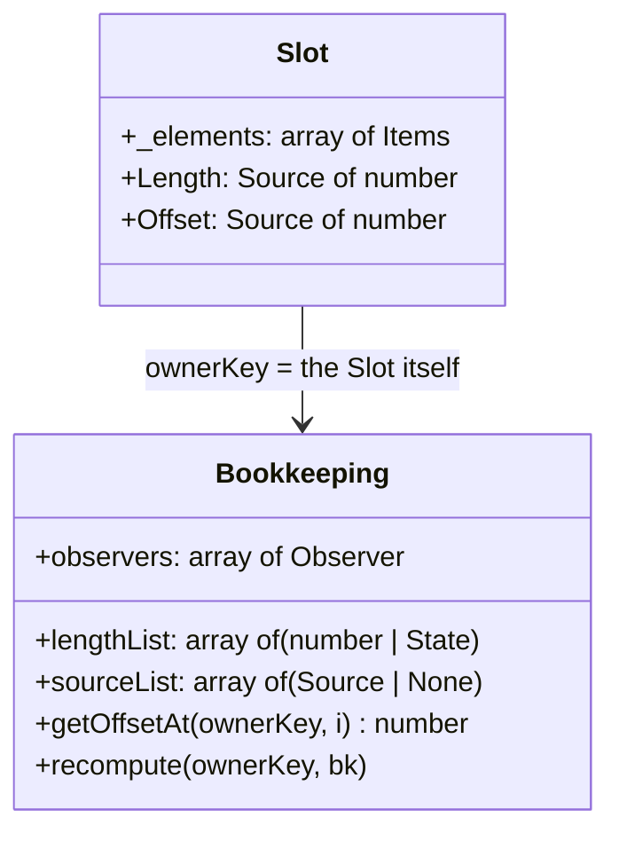

> **작성 목적**: 프레임워크 아키텍트 및 고급 엔지니어를 위한 기술 해설서
> **관련 소스**: `quad-base/src/Slot/init.luau`, `quad-base/src/Slot/Raw.luau`, `quad-base/src/Slot/List.luau`, `quad-base/src/Bookkeeping.luau`

> [!CAUTION]
> 이 권은 Slot 부분합 부기의 내부 동작을 다룹니다. 애플리케이션을 만들려고 quad를 배우는 중이라면 [Getting Started](/getting-started/01-first-screen/)부터 보십시오.

---

## 1. 가상 DOM이 없는 세계의 구조적 도전

전통적인 선언형 UI 프레임워크는 화면에 요소를 추가/삭제하거나 순서를 바꿀 때 **가상 DOM 트리**를 만들고 이전 트리와 diff를 떠서 실제 트리에 패치를 가합니다.

Quad는 그러지 않습니다 — 가상 DOM이 없고(DOMless), 컴포넌트는 인스턴스를 즉시 만듭니다. 그러면 질문이 남습니다:

> **"중간 트리가 없다면, 여러 컴포넌트가 중첩되고 자식이 동적으로 삽입·삭제·재정렬될 때 각 요소가 물리 트리에서 몇 번째 자리를 차지하는지 무엇이 계산하는가?"**

Quad의 답이 **Slot-in-Slot 부분합(Prefix Sum) 부기**입니다.

---

## 2. Slot의 내부 해부도: 요소 배열 + 3중 부기

하나의 `Slot`은 논리 요소 배열 `_elements`를 갖고, 그와 **평행한 위치 인덱스로** 세 개의 부기 배열을 유지합니다. 부기는 Slot이 직접 들고 있는 게 아니라 별도 서브시스템(`quad-base/src/Bookkeeping.luau`)이 **소유자 키(ownerKey)별로** 관리합니다:



1. **`_elements`**: 슬롯이 품고 있는 논리 요소 배열 (Instance, 또는 또 다른 자식 Slot — 맨 `State`는 감싸져 들어옵니다).
2. **`lengthList[i]`**: 그 위치가 물리 트리에서 차지하는 **길이**. 단일 Instance면 `1`, 자식 세 개짜리 자식 Slot이면 `3`, 비어 있으면 `0`. 상수일 수도 `State`일 수도 있습니다.
3. **`sourceList[i]`**: 그 위치의 절대 오프셋을 **발행할 채널**. 자식 Slot이면 그 Slot 자신의 `Offset` Source이고, 발행할 곳이 없는 잎이면 `None`입니다(`None`은 "참여 안 함"이 아니라 "발행 채널 없음"입니다 — 참여 여부는 `lengthList`가 답합니다).
4. **`observers[i]`**: 길이가 `State`인 위치에만 붙는 길이 관측자. 상수 길이 위치엔 없습니다.

**부기의 수명**: 소유자가 Slot이면 그 Slot이 자기 `bk`를 **강하게** 들고 있습니다(`slot._bk`) — 언마운트를 넘어 살아남아야 하기 때문입니다. 소유자가 물리 Instance면 weak 릴레이션에 담고 실제 GC 앵커는 `bindLifetime(inst, bk)`이 잡습니다(Vol. 3의 토폴로지 그대로).

---

## 3. Slot-in-Slot: 중첩과 온디맨드 부분합

슬롯 안에 또 다른 슬롯이 제약 없이 중첩됩니다.

```
Parent Slot
├── [1] Frame A                     (length: 1, offset: 0)
├── [2] Child Slot B                (length: 3, offset: 1)
│       ├── [2-1] TextLabel B-1     (length: 1)
│       ├── [2-2] TextLabel B-2     (length: 1)
│       └── [2-3] TextLabel B-3     (length: 1)
└── [3] Frame C                     (length: 1, offset: 4)
```

`Child Slot B`에 `B-4`가 추가되어 길이가 3에서 4로 늘면:

1. `B`의 `Length`가 바뀌고, 부모의 `observers[2]`가 그걸 받습니다.
2. 관측자가 `gatedRecompute`를 부르고, 그건 두 커서(`offsetCacheValidUpTo`/`offsetSetUpTo`)를 그 위치까지 되감습니다.
3. `Frame C`의 오프셋은 미리 계산돼 있는 게 아니라 `getOffsetAt(owner, 3)`이 **필요할 때** 앞선 길이들을 누적해 채웁니다(부분합 캐시는 커서 아래까지만 유효).
4. `recompute`가 발행 채널이 있는 위치마다 새 절대 오프셋을 `:Set`하고, 마지막에 이 Slot 자신의 `Length`를 갱신합니다 — 그게 다시 조부모의 부기를 깨웁니다.

**오프셋이 실제로 무엇에 쓰이나**: Roblox 백엔드는 자식 순서를 물리 프로퍼티로 갖지 않아서 `nativeInsert`/`nativeExtract`가 받은 오프셋을 **무시합니다** — 그 인자는 순서가 물리적인 백엔드(DOM 등)와 공유하는 계약입니다. Roblox에서 실질적 소비자는 **`updateFn`이 받는 `offset` Source**이고, 사용자가 거기서 `LayoutOrder` 같은 걸 계산합니다(Slot이 대신 바인딩해주지는 않습니다 — 요소가 이미 지정한 값을 덮어쓰는 매직이 되기 때문).

**순서 변경은 물리 op가 아닙니다.** `rawMove`는 Roblox에서 `nativeMove`를 부르지만 그 구현은 **의도적인 no-op**입니다. 실제로 순서를 바꾸는 건 `lengthList`/`sourceList`/`observers`를 `_elements`와 **같은 순열로** 회전시키는 `rotateInPlace`와 뒤따르는 recompute뿐입니다. `sourceList`가 특히 위치가 아니라 요소에 묶인 값(중첩 Slot 자신의 `.Offset`)이라, `_elements`만 회전시키면 recompute가 옛 점유자의 Source에 오프셋을 써 넣습니다.

---

## 4. 파동 폭풍 방지: 배치 Blocker와 `rawSplice`

1,000개짜리 슬롯을 한 번에 비우거나 교체할 때 요소마다 관측자가 발화하고 오프셋이 재계산되면 재계산이 제곱으로 불어납니다. `rawSplice`(`quad-base/src/Slot/Raw.luau`)는 이걸 배치 게이트로 접습니다 — 흐름만 발췌하면:

```luau
local gate = if self._physicalTarget ~= nil then S.BK.getBlocker(self) else nil -- [1] 배치 Blocker
local ownsGate = gate ~= nil and not gate:IsOn()
if ownsGate then gate:On() end

base = S.BK.getOffsetAt(self, index) -- [2] 변형 전에 읽는다(캐시는 현재 배치를 서술)
-- ... removedLeaves 수집 ...
for i = index + removeCount - 1, index, -1 do
    rawUnmount(self, i, true)        -- [3] deferPhysical: 부기만, 물리 op는 미룬다
end
for k, element in ipairs(newElements) do
    rawAdd(self, element, index + k - 1, nil, true)
end
-- ... newLeaves 수집 ...
-- [4] 물리 op 단 한 번 (제거가 없으면 nativeInsert 한 번)
module.nativeExtract(self._mountedInst, base, removedLeaves, if #newLeaves > 0 then newLeaves else nil)

if ownsGate then
    gate:OffWithoutEmit()            -- [5] 파동 없이 게이트 해제
    maybeRecompute(self, S.BK.getBookkeeping(self))  -- [6] 최종 재계산 1회
end
```

핵심은 `deferPhysical` 플래그입니다 — `rawUnmount`/`rawAdd`가 각자 물리 op를 쏘는 대신 부기만 하고, 잎(leaf) 배열을 모아 **`nativeExtract` 한 번**으로 제거와 삽입을 동시에 처리합니다(제거가 없으면 `nativeInsert` 한 번). 그리고 그 사이 모든 `maybeRecompute` 호출은 배치 Blocker와 재진입 Blocker **둘 다** 확인하고 조용히 돌아갑니다 — 건너뛴 재계산이 하는 일은 바깥 패스가 커서를 되감으며 회수합니다.

---

## 5. 결론

가상 DOM이 주던 "구조적 안정성"을 중간 트리 없이 얻기 위해, Quad는 **위치별 부분합 부기 + 게이팅**을 씁니다. 얻는 것과 대가는 이렇습니다:

1. **diff할 트리를 만들지 않습니다** — 대신 각 Slot이 자기 위치 부기를 계속 들고 있어야 하고, 그 정합성(길이·오프셋·순열)이 곧 정확성입니다.
2. **재정렬이 물리 op를 안 부릅니다** — `nativeMove`/`nativeSwap`가 Roblox에서 no-op **오버라이드**인 건 게으름이 아니라 의도입니다. 합성 폴백에 맡기면 물리적으로 아무 의미 없는 재정렬을 위해 `.Parent`를 두 번 써서(떼었다 붙여서) `AncestryChanged`를 다시 쏘고 깜빡임을 만듭니다. 다만 비파괴 제거는 여전히 `.Parent = nil`을 씁니다 — `nativeExtract`가 하는 일이 정확히 그것입니다(Vol. 5).
3. **무한 중첩이 특수 경로 없이 됩니다** — 자식 Slot의 `Length`가 부모의 `lengthList` 한 칸일 뿐이라, 중첩은 같은 산술의 재귀입니다.
